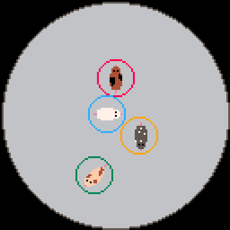
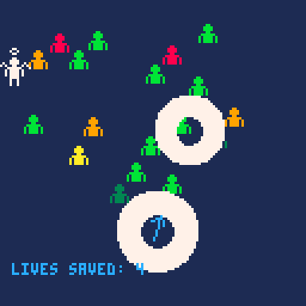
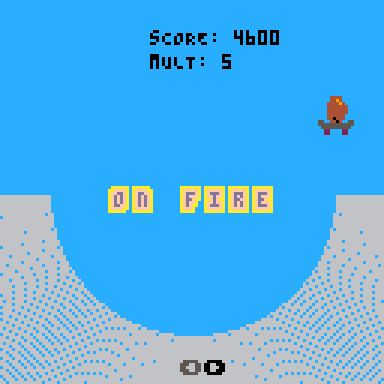
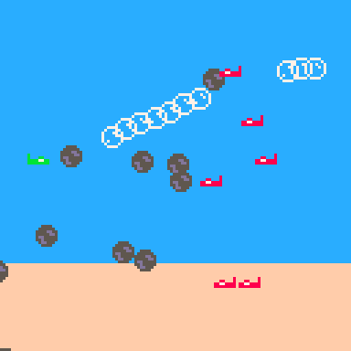
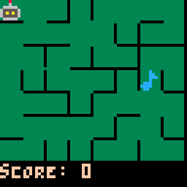

# PICO-8 Games
A collection of games made with [PICO-8](https://www.lexaloffle.com/pico-8.php)

<!--BEGIN GAMES-->
<!--BEGIN tile-island-->
## [Tile Island](carts/tile-island)

<!--END tile-island-->

<!--BEGIN fetch-quest-->
## [Fetch Quest](carts/fetch-quest)

<!--END fetch-quest-->
<!--BEGIN binary-minery-->
## [Binary Minery](carts/binary-minery)

<!--END binary-minery-->
<!--BEGIN minigame-mania-->
## [Minigame mania](carts/minigame-mania)

<!--END minigame-mania-->
<!--BEGIN snowman-simulator-->
## [Snowman Simulator](carts/snowman-simulator)

<!--END snowman-simulator-->

<!--BEGIN hex-hacker-->
## [Hex Hacker](carts/hex-hacker)

<!--END hex-hacker-->
<!--BEGIN grow-big-or-go-home-->
## [Grow Big or Go Home](carts/grow-big-or-go-home)

<!--END grow-big-or-go-home-->

<!--BEGIN hamster-slam-->
## [Hamster Slam](carts/hamster-slam)

<!--END hamster-slam-->

<!--BEGIN math-abcs-->
## [Math ABC's](carts/math-abcs)

<!--END math-abcs-->

<!--BEGIN electemon-->
## [Electémon](carts/electemon)

<!--END electemon-->
<!--BEGIN swimsaver-->
## [Swimsaver](carts/swimsaver)

<!--END swimsaver-->

<!--BEGIN improve-remove-premove-->
## [Improve, Remove, Pre-Move](carts/improve-remove-premove)

<!--END improve-remove-premove-->
<!--BEGIN skater-tater-->
## [Skater Tater](carts/skater-tater)

<!--END skater-tater-->

<!--BEGIN drifting-keep-->
## [Drifting Keep](carts/drifting-keep)

<!--END drifting-keep-->
<!--BEGIN shuri-ken-->
## [Shuri-Ken](carts/shuri-ken)

<!--END shuri-ken-->

<!--BEGIN slylighter-->
## [Slylighter](carts/slylighter)

<!--END slylighter-->
<!--BEGIN cannonbubs-->
## [CannonBubs](carts/cannonbubs)

<!--END cannonbubs-->

<!--BEGIN beat-bot-->
## [Beat Bot](carts/beat-bot)

<!--END beat-bot-->

## [Camfire Simulator](carts/campfire-simulator)

## [Picoquarium](carts/picoquarium)
