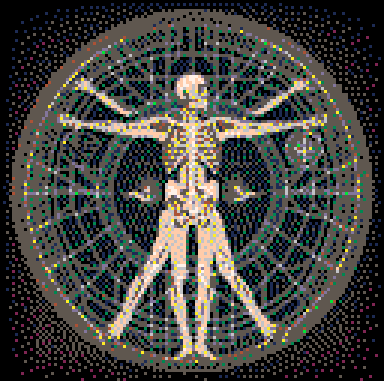
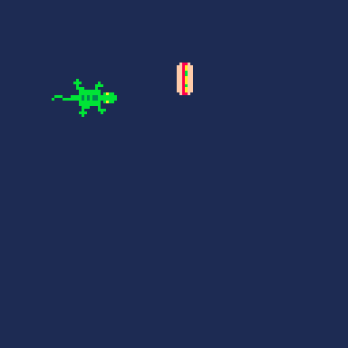
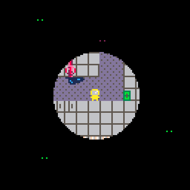
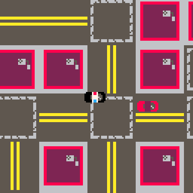
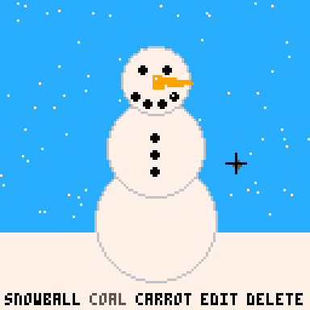
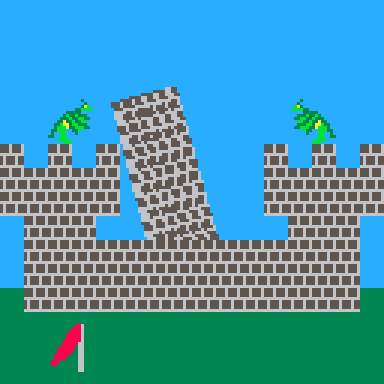

# PICO-8 Games
A collection of games made with [PICO-8](https://www.lexaloffle.com/pico-8.php)

<!--BEGIN GAMES-->
<!--BEGIN root-loops-->
## [Root Loops](carts/root-loops)
Is it a tree or is it cyclic?

<!--END root-loops-->
<!--BEGIN seaside-scramble-->
## [Seaside Scramble](carts/seaside-scramble)
Unscramble the seaside critters!

<!--END seaside-scramble-->
<!--BEGIN broke-out-->
## [Broke Out](carts/broke-out)
Like Breakout, but broken

<!--END broke-out-->
<!--BEGIN firewall-fiasco-->
## [Firewall Fiasco](carts/firewall-fiasco)
Use the firewall to hold off the malicious programs as long as possible!

<!--END firewall-fiasco-->
<!--BEGIN the-titan-->
## [The Titan](carts/the-titan)
Choose your truth

<!--END the-titan-->
<!--BEGIN hot-dog-lizard-->
## [Hot Dog Lizard](carts/hot-dog-lizard)
Get that hot dog!

<!--END hot-dog-lizard-->
<!--BEGIN picade-simulator-->
## [Picade Simulator](carts/picade-simulator)
Play all your favorite PICO-8 games in one place!

<!--END picade-simulator-->
<!--BEGIN paybac-man-->
## [Paybac-Man](carts/paybac-man)
Live for nothing, or die for something

<!--END paybac-man-->
<!--BEGIN simon-says-tweet-->
## [Simon Says Tweet](carts/simon-says-tweet)
A tweetable Simon Says game

<!--END simon-says-tweet-->
<!--BEGIN frog-teleporter-->
## [Frog Teleporter](carts/frog-teleporter)
Teleport all of the frogs away before they overpopulate the earth

<!--END frog-teleporter-->
<!--BEGIN dream-sense-->
## [Dream Sense](carts/dream-sense)
Sense monsters from the dream world and psychic-blast them away!

<!--END dream-sense-->
<!--BEGIN galaxy-tweet-->
## [Galaxy Tweet](carts/galaxy-tweet)
A tweetable galaxy simulator

<!--END galaxy-tweet-->
<!--BEGIN spray-ya-later-litigator-->
## [Spray Ya Later Litigator](carts/spray-ya-later-litigator)
Don't let Big Water shut you down!

<!--END spray-ya-later-litigator-->
<!--BEGIN skyline-tweet-->
## [Skyline Tweet](carts/skyline-tweet)
Tweet cart that generates scrolling city skyline

<!--END skyline-tweet-->
<!--BEGIN pascal-rorschach-tweet-->
## [Pascal-Rorschach Tweet](carts/pascal-rorschach-tweet)
Rorschach Test-like Pascal's Triangle generation

<!--END pascal-rorschach-tweet-->
<!--BEGIN tiny-chess-board-->
## [Tiny Chess Board](carts/tiny-chess-board)
Non-interactive low resolution chessboard

<!--END tiny-chess-board-->
<!--BEGIN northern-corridor-->
## [Northern Corridor](carts/northern-corridor)
You must decipher the locking mechanism to proceed

<!--END northern-corridor-->
<!--BEGIN make-cow-->
## [Make Cow](carts/make-cow)
Combine resources. Make cow.

<!--END make-cow-->
<!--BEGIN toadally-normal-matching-game-->
## [Toadally Normal Matching Game](carts/toadally-normal-matching-game)
Match holidays

<!--END toadally-normal-matching-game-->
<!--BEGIN terrain-generator-->
## [Terrain Generator](carts/terrain-generator)
Generate terrain using Perlin noise

<!--END terrain-generator-->
<!--BEGIN health-inspectre-->
## [Health Inspectre](carts/health-inspectre)
Hide in the darkness or get caught by ghosts!

<!--END health-inspectre-->
<!--BEGIN kaiju-companions-->
## [Kaiju Companions](carts/kaiju-companions)
Breed miniature kaiju

<!--END kaiju-companions-->
<!--BEGIN timey-wimey-stuff-->
## [Timey Wimey Stuff](carts/timey-wimey-stuff)
Guide yourself through space and time!

<!--END timey-wimey-stuff-->
<!--BEGIN cool-cat-cafe-->
## [Cool Cat Cafe](carts/cool-cat-cafe)
Work as a purrista at a cat cafe!

<!--END cool-cat-cafe-->
<!--BEGIN pursuit-in-progress-->
## [Pursuit in Progress](carts/pursuit-in-progress)
Don't let the perp escape!

<!--END pursuit-in-progress-->
<!--BEGIN toxic-toads-->
## [Toxic Toads](carts/toxic-toads)
Infect all the toads!

<!--END toxic-toads-->
<!--BEGIN unsigned-hero-->
## [Unsigned Hero](carts/unsigned-hero)
Fight your way higher and higher to the 255th level of the dungeon

<!--END unsigned-hero-->
<!--BEGIN shark-shoot-->
## [Shark Shoot](carts/shark-shoot)
Lure unsuspecting bugs to their demise

<!--END shark-shoot-->
<!--BEGIN dragon-drop-off-->
## [Dragon Drop-Off](carts/dragon-drop-off)
Dragons are attacking your plane. Drag them away so you can drop off your cargo!

<!--END dragon-drop-off-->
<!--BEGIN rainbows-->
## [R.A.I.N.B.O.W.S.](carts/rainbows)
Defend yourself using the Radial Anti-Inbound Non-Ballistic Offensive Weapon System

<!--END rainbows-->
<!--BEGIN countdown-to-meltdown-->
## [Countdown to Meltdown](carts/countdown-to-meltdown)
Stablize the reactor before it causes a meltdown!

<!--END countdown-to-meltdown-->
<!--BEGIN lofty-lunch-->
## [Lofty Lunch](carts/lofty-lunch)
Build an epic sandwich

<!--END lofty-lunch-->
<!--BEGIN tile-isle-->
## [Tile Isle](carts/tile-isle)
Shuffle the tiles to reveal the map of the island

<!--END tile-isle-->
<!--BEGIN fetch-quest-->
## [Fetch Quest](carts/fetch-quest)
Who let the dogs in outer space?

<!--END fetch-quest-->
<!--BEGIN binary-minery-->
## [Binary Minery](carts/binary-minery)
Use your drill to mine bitcoins!

<!--END binary-minery-->
<!--BEGIN minigame-mania-->
## [Minigame mania](carts/minigame-mania)
Repair arcade cabinets and then play them!

<!--END minigame-mania-->
<!--BEGIN snowman-simulator-->
## [Snowman Simulator](carts/snowman-simulator)
Do you want to build a snowman?

<!--END snowman-simulator-->
<!--BEGIN hex-hacker-->
## [Hex Hacker](carts/hex-hacker)
Q: How do you defeat an evil hex? A: Use a hex editor

<!--END hex-hacker-->
<!--BEGIN grow-big-or-go-home-->
## [Grow Big or Go Home](carts/grow-big-or-go-home)
Eat the other microbes to grow big...or be eaten yourself!

<!--END grow-big-or-go-home-->
<!--BEGIN hamster-slam-->
## [Hamster Slam](carts/hamster-slam)
Knock the other hamster balls out of the ring!

<!--END hamster-slam-->
<!--BEGIN math-abcs-->
## [Math ABC's](carts/math-abcs)
Test your math knowledge!

<!--END math-abcs-->
<!--BEGIN electemon-->
## [Electémon](carts/electemon)
Defeating the Orangemon has been unachievable. The only thing to do now is vote!

<!--END electemon-->
<!--BEGIN swimsaver-->
## [Swimsaver](carts/swimsaver)
Save the swimmers from drowning

<!--END swimsaver-->
<!--BEGIN improve-remove-premove-->
## [Improve, Remove, Pre-Move](carts/improve-remove-premove)
A game of strategy where being predictable will cost you

<!--END improve-remove-premove-->
<!--BEGIN skater-tater-->
## [Skater Tater](carts/skater-tater)
Are you the hottest spud? Land three tricks in a row to prove it

<!--END skater-tater-->
<!--BEGIN drifting-keep-->
## [Drifting Keep](carts/drifting-keep)
The castle keep is drifting in the wind. Stop it from falling down

<!--END drifting-keep-->
<!--BEGIN shuri-ken-->
## [Shuri-Ken](carts/shuri-ken)
Fight star ninjas with ninja stars

<!--END shuri-ken-->
<!--BEGIN slylighter-->
## [Slylighter](carts/slylighter)
Help the star get back home by turning off the lights

<!--END slylighter-->
<!--BEGIN cannonbubs-->
## [CannonBubs](carts/cannonbubs)
Shoot down enemy planes with hard or fast projectiles

<!--END cannonbubs-->
<!--BEGIN beat-bot-->
## [Beat Bot](carts/beat-bot)
The robot only responds to commands when they are in time with the music

<!--END beat-bot-->
<!--BEGIN campfire-simulator-->
## [Campfire Simulator](carts/campfire-simulator)
Enjoy toasting a marshmallow from the comfort of your home

<!--END campfire-simulator-->
<!--BEGIN picoquarium-->
## [Picoquarium](carts/picoquarium)
Inspired by the command line program ASCIIQuarium

<!--END picoquarium-->
