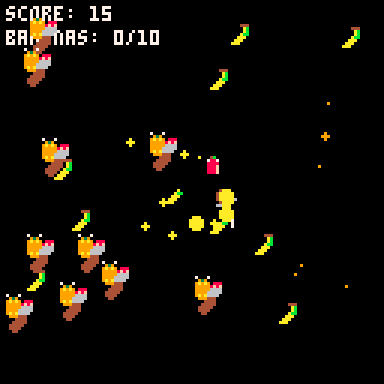

# Apples and Banaynays
Take on the evil oranges while slicing your way to banana-y goodness. 
But watch out for the bonus level - everything is not as it seems

Play it now on [itch.io](https://minimechmedia.itch.io/apples-and-banaynays)

## Controls
* X - Swing sword
* Arrow Keys - Move

# About

Source code available on [GitHub](https://github.com/MiniMechMedia/pico8-games/tree/master/carts/apples-and-banaynays)

## Acknowledgements
* Game design and art by Ryan
* Music is from [Gruber](https://www.lexaloffle.com/bbs/?uid=11292)'s [Pico-8 Tunes Vol. 2](https://www.lexaloffle.com/bbs/?tid=33675), Track 3 - Like Clockwork 
 Licensed under [CC BY-NC-SA 4.0](https://creativecommons.org/licenses/by-nc-sa/4.0/)

