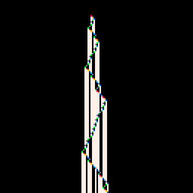

# BB6 Champion Tweet


[](https://minimechmedia.itch.io/bb6-champion-tweet)

Leave a comment on [itch.io](https://minimechmedia.itch.io/bb6-champion-tweet)

This cart is tweetable at just 244 characters.

## Source
Remix it on [pico-8-edu.com](https://pico-8-edu.com/?c=AHB4YQGtAUfrwcnBHZs3H3709Q9w_wM8QPgI73B9kDQG1zucc809RbK2EeR1XJRNu7BggvOzidQSz9AFZfEQI6-Q1cWGeogF3qBN6odY8kbSBGV93VmB4WY2plYiBREBEf2goIur6ridfqAcqdv8IaKgqbIsq7KszZoqq1QJSlXSQJXoHqXxDAUvceJa0y6VZ91VrfRZFZ5WXLfYNGU5FTxCESSD-Woa9VHbrDRv8RrRQ8xNra6GB45MVbthuhrmjzDyDI6Y6PJuamMgmFpIgtADRbJUJM2NTRUd6aikWvJA5iw-VcnQ2EJ049aRM0U7MrI-svIM2UIwm3Rb43tleaMX-JD1Vipmk_m9ub21yWJj58ytWHGkr5JwKNIKUAyIBzYUwlEvzud3FgIGFlAfERmYEBjI69nloRl5g5UFpYP93aFieLgF)
```lua
y=1
cls()
pal(1,140,1)
::_::
x=64
s=0
t={}
for n=2,y do
h=t[x]or 0
n=({221,220,222,_,203,125,220,104,103,222,220,124})[2*s+h+1]
w=n\100-1
dir=n%100\10
s=n%10
pset(x,y,w*7)
t[x]=w
x+=dir-1
end
pset(x,y,({8,9,1,11,13,12})[s+1])
flip()
y+=1
goto _
```

## Explanation
Remix it on [pico-8-edu.com](https://pico-8-edu.com/?c=AHB4YQJnAa3rwcnBHZs3H3709Q9w_wM8QPgI73B9kDQG1zucc809RbK2EeR1XJRNu7BggvOzidQSz9AFZTnxDFGkHPAE5Ub8DkOmSJpgJz7uqsBwMxv9QCQdohwiHBR0cVXdNtOPlBN1m29EQVNlWVZlWZs1VVbJEZRypIEckdLIxjOU2Uld1ccDYdgUQ2VXjERNP9MHXlEwl1aIAulM4Io0yMqJZGWlizammjJJVp6gaeqZIIiiemqrewQ3lE3Vh03T_cJNXTUWvMSNbbOTtSNbW5UsQnjXW1wXtNclwYIHimSiSJrzmio60FFJdaAHMmf5qUpe476NqbmlYmZEOGC2v7Hoi8ICkiHO6aqNtp1dyipb9PoBWTYcrBRB8hZD410UT8XFXLeURVWfZVtD3eDQ0O5eOLY0WC2G6XA_UKXOeYSdZ-DFStmX1UqoU45w4Ej9oCuFQoLBuD1gZVdNQCXkGbKBYDnpJrLOTlfawRJyg46M1uZGNkZXxsYK3aCRO1dbscElQxXdTiMgICPQTk2IhUPqbEp5bGQpTfdmd1YkDiZyEYX5wZlicbcF)
```lua
-- Let's implement the current BB6 champion
-- https://bbchallenge.org/1RB1RA_1RC---_1LD0RF_1RA0LE_0LD1RC_1RA0RE

y=1
transition=({221,220,222,_,203,125,220,104,103,222,220,124})
colors=({8,9,1,11,13,12})
cls()
pal(1,140,1)
::_::
x=64
state=0
tape={}
for n=2,y do
head=tape[x]or 0
next=transition[2*state+head+1]
write=next\100-1
dir=next%100\10
state=next%10
pset(x,y,write*7)
tape[x]=write
x+=dir-1
end
pset(x,y,colors[state+1])
flip()
y+=1
goto _
```


## About


Source code available on [GitHub](https://github.com/MiniMechMedia/pico8-games/tree/master/carts/bb6-champion-tweet)

