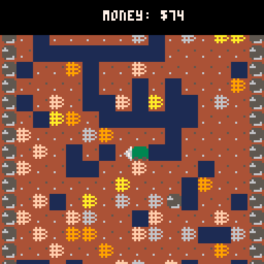

# Binary Minery
Get as much money as you can by mining bitcoins! Drill deep to get the most valuable bitcoins. (I didn't get this as developed as I would have liked, so there's no real end goal. Just have fun!)

Play it now on [itch.io](https://caterpillargames.itch.io/binary-minery)

## Controls
* Arrow Keys - Move/Drill

## Hints
* You cannot drill upwards, and you cannot drill sideways if you are not resting on a block
* Boulders cannot be drilled through

## About
<!--BEGIN TRIJAM-->
Created for [TriJam #101](https://itch.io/jam/trijam-101/entries)  
Theme: Binary  
Development Time: 3h 34m 50s  
<!--END TRIJAM-->

Source Code: On [GitHub](https://github.com/CaterpillarGames/pico8-games/tree/master/carts/binary-minery)

## Acknowledgements
Inspired by the game [Motherload by XGen Studios](http://www.xgenstudios.com/play/motherload)

