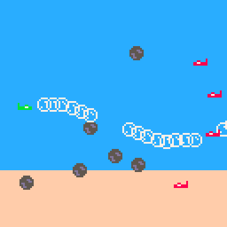

# Cannonbubs
Shoot down enemy planes. Your projectiles are *hard* and *fast* - just not at the same time. 
Cannonballs are slow but can destroy planes. Bubbles are fast and don't do damage, but they can move cannonballs off course.

Play it now on [itch.io](https://caterpillargames.itch.io/cannonbubs)

## Controls
* Arrow Keys to move your plane
* Z to shoot bubble
* X to shoot cannonball
* P to pause

## About
Created for [TriJam #85 - Hard and Fast](https://itch.io/jam/trijam-85/rate/750617)
