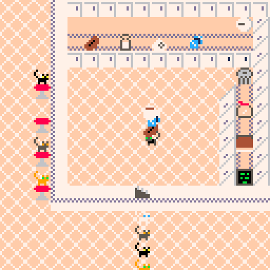

# Cool Cat Cafe
You are a purrista at the Cool Cat Café. Serve as many cats as you can before your shift is over.

Supports 2-player co-op.

* Use the cat register to seat customers
* Use the computer screen to see what the customers have ordered
* Use the recipe book to find out how to make an order
* Use the ingredients counter to grab coffee beans, milk, sugar, or ice
* Use the coffee pot to put ingredients in it
    * Press Z on the coffee pot to grab the finished drink
* Use the trash can to discard unneeded ingredients or drinks
* Activate a seated customer to serve them a drink
* Your shift is up after 3 minutes

Play it now on [itch.io](https://caterpillargames.itch.io/cool-cat-cafe)

## Controls
* Arrow Keys - Move
* X - Use / Activate
* Z - Take the drink out of the coffee pot
* P - Pause menu. Allows selecting 2-player mode
* ESDF - Move (player 2)
* Q - Use / Activate (player 2)
* Tab - Take the drink out of the coffee pot (player 2)

## Hints
* When you take an ingredient or drink, it is added to the top of the stack. But when you use an ingredient or drink, it comes off the bottom of the stack
* If you try to make a drink that isn't in the recipe book, you will create sludge, which will have to be thrown away.
* Serve drinks faster by grabbing all the ingredients for multiple orders at the same time

# About
Created for [TriJam 120](https://itch.io/jam/trijam-120/entries)  
Theme: Coffee  
Development Time: 4h 41m 24s  

Also submitted to [MiniJam 80](https://itch.io/jam/mini-jam-80-cats)  
Theme: Cats  
Limitation: 8x8 textures  

Source code available on [GitHub](https://github.com/CaterpillarGames/pico8-games/tree/master/carts/cool-cat-cafe)

## Acknowledgements
Font is from Zep's [PICO-8 0.2.2 release notes](https://www.lexaloffle.com/bbs/?tid=41544)  

Music is from Gruber's [Pico-8 Tunes Vol. 1](https://www.lexaloffle.com/bbs/?tid=29008), Track 12 - Village. 
Licensed under [CC BY-NC-SA 4.0](https://creativecommons.org/licenses/by-nc-sa/4.0/)

