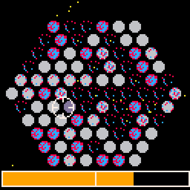

# Countdown to Meltdown
The reactor core is unstable. Target the atoms to stop them from splitting. 
50% of them splitting is enough to cause a reactor meltdown

Play it now on [itch.io](https://caterpillargames.itch.io/countdown-to-meltdown)

## Controls
* Arrow Keys - Move cursor. Hovered atoms become stable

# About
Created for [TriJam 112](https://itch.io/jam/trijam-112/entries)  
Theme: 50% is enough  
Development Time:   

Source code available on [GitHub](https://github.com/CaterpillarGames/pico8-games/tree/master/carts/countdown-to-meltdown)

Also submitted to [Mini Jam 76](https://itch.io/jam/mini-jam-76-radiation)  
Theme: Radiation  
Limitation: One Handed Controls
