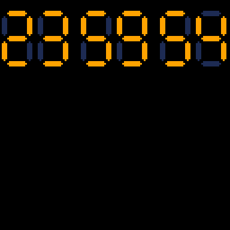

# Digital Countdown Tweet
A [seven-segment display](https://en.wikipedia.org/wiki/Seven-segment_display) countdown implemented in a tweetcart.


[](https://minimechmedia.itch.io/digital-countdown-tweet)

Leave a comment on [itch.io](https://minimechmedia.itch.io/digital-countdown-tweet)

This cart is tweetable at just 280 characters.

## Source
Remix it on [pico-8-edu.com](https://pico-8-edu.com/?c=AHB4YQHXAXbrwdGXH148wtXX7x7_AK-wAl0avUPUVc31QdIY8B2uOeacIhmbCN5gIi7Kph14ARMMZBtp4Il36IKyeIhnmOnqYiNdiUoLiAnUM2-gjaQL0vq6qwLDzWzEI5GEiIKIgFDQ5VV13MzWRLlSt-lDREFTZVlWZVmbNVVWyRKWssSBLNE5cuMZCsKd7Kaj3uHEuZ3gEYoguqxaHHqGNKuC4y5sXZPl4ViZL2Rpe1l9YFlVb1BV2YmxD27sh7p3aOMLR7ouXsnyrDty78axYr12Q7Q8NzUyFSZFMZWFE2W03r1ENjaxsjLUVVsuWAjrzYmJbGwqjxe0BhYOjKfSkYUV9SAPFF7wTR5urHQD5aED0eDQAcPxYFzvbTYTCwsu2EvctuGmvaR9i-Hmzq1kbTKJiqWgSDaTpEmKgWSpaF5j6h3y3BJZW_wWq5sDcRQNRpErdpeah7DApcmxwXSrMrA2uXVHd8QJzcTO9hHZepFdUAE=)
```lua
cls()k=0::_::k+=1if(k==270)k=0flip()
f=k%15p=k\15%6i=k\90-1j=p*20-5+p\2*4a,c,d=-5+abs(i),i,i
b=-a
x,y=f\5+1,f%5+1s=-t()%60\1
if(x!=2)a,b,c,d=c,d,a,b
if((x+y)%2>0)line(j+x*7+a,y*7+c,j+x*7+b,y*7+d,({8,31,65,3,22,34,32,27,0,2})[({2,3,5,9,s\10,s%10})[p+1]+1]&1<<f\2>0and 1or 9)
goto _
```

## Explanation
Remix it on [pico-8-edu.com](https://pico-8-edu.com/?c=AHB4YQrHBY-rwdGXH148wtXX7x7_AK-wAl0avUPUVc31QdIY8B2uOeacIhmbCN5gIi7Kph14ARMMZBtp4Il36IKynHiHKGriREWgHXkCUyQjwTO0110VGG5lI_4j7RDpEOWgoJuoquNWtlbKjbrNR6KgqbIsq7KszZoqq-QISz3iQI9oJei2qpNuEiLYGdiJm2asj-o0yIosGJEuy7L6GS5ca5aCNygClZDb4leIU39tRGsDC300lwR7zVwykiTRoA-G6i5p5QvaMFQREg3KirDrIj9JDEkEKSQlk1GSdFlmnzKPqtvkwv-05eBgkqZVGyoi1JWEOCTD33oiyMIwMU0ZL1US4vJCOddIntwnQtbVtxWr99l7YSMdyfYmog1jTcmFFQN1ICq8F5534GJTqius7CRxm2ZJG_RFsThzX7-STq1mVeCPVd2EaDCbUVdTCBE5GugHkjWBlIlBv0w8RDM1s9eIJjVVXWyKoeRDQ1EqtFSkaavGNKR-uOqtlZnzlgYzjSnDvkHTRJsqwfJnrrhxbzpTd5kaGxgQlJiekhQTX9ss57qlnZ2tOIs7lYhhbaWm2VIlE4W5USBU1yELRQKiOsm2pCKqZHFvcTGSr9goSzOGxUhXD1a6hBMahCrlGZ6ZGRpbNXzmqmxGe0bmSJ5VRKCcKgbkViY2NqaibKpZ6fRlwnltqSgaWS6nJGu2IqGWsBVhUQtRS1OiSItEQWMn2SrSRgJeSkgqsF2tE1c7p6sko-UiI4nQtKiCJl3UM5mbewkXz4xqGZTj8bLmOpdDv9PulRGSDrCJMJNazmRdr2hWydRPGqPc9EC6OaWPPSJ7NLSbTmhuDAxNDeVSJ2JlQsKRFrJoprzPgKxDHcoli3VoJvTt9uqm4NVI1GlDlH2_FRQrA5pMQh0L4Yiax4okfkaaLllQIdqMLi0SoyRWcfzPhYF0Sr5_oxvdmkyyo5abRqZOQk5_Ixd1Ff9Z6qkmoBjaXFFMXZlYkd7YTiSglB60M4akIgLpDOQKEzFYwa4gmap6eacIAv2dZd1YUR2RkK16bSyUT0zr0TTqZus5ue6NlcW01rzxQliuT5ZSFFm3szDQzqpdzk33s7N720uTk6n0x_qB8XKq5bGR7RhA92NU0526FLIKfTE1NSbgEq00czI3W1tD5VM0dRmmw-XeXjWrHtrVqTDFapUuLqR6MC-RJPoYVbURJUIcGyJDunQumVGnn9fjLo3AFZEDZZ_VdLLQMVHzWJCaadsZSZh0Wfj9lsGIRiqR3lul64oRXVnlj4EwS_UD_iKJ6mpUeCNo9brQIiAJE3Xrhd4q0tcjQdd2QxILrX7K5tx0uzY6dOuoiDqUf0KkCF8XHnBCI8fphNRJgksy4W8oExws6rLG8hb1sNTu5NSOAEdUwW0QEwbm2bYMO7YkQqksHJJE6jsrxQEzodyR6Gs6t1COmYPAA8YFZWQc1uZxL6hH5pC92ZT5QoQ6VGKlPuJYGAaeA6swTgRnFhIZob7LKueIl0NNelKDIB4x1tZbnDF0wnqyf0ESFWtBkdyQJE1STCUbRfMasw_xvmNABZ2ZtRVJKz2LQTVzye0fouGRnwiml44VgjlAKkfSSMocClmDq2NpGcxqjUv9YQ48w4R8FPTkvDdkTnQtVqvFRYFyMYhIsNwmk7p8VBBeKePJSZmDcq-YLcQ4j9jcs_p4kqgeIHJ4ppOXEOUdWZnQQBtZkzlQXUiYOzRTJBO2UMHRkxNpD8UHo4qI3MHERCXMJNOi2qSsFgk7zzePEU5HSp0K5Om2s2QIDsIrU6b4pCohc3hue3Dg-22IY4jYo_861YbBgUXiEVLhqJyQL9BPyFZkihM2wsms1LHWuIi0fTpyEekmfAXRIb3sxZSbdvkgaL-SqrhlGA==)
```lua
cls()
-- Our overall loop counter
k=0
::_::
-- 3 for loops have been inlined into the main loop:
-- One to loop over the digit we want to draw,
-- one to loop over the segments within the digit,
-- one to loop over offsets to make the segment thick
-- 6 digits * 15 segment grid points * 3 thickness offsets = 270 iterations needed
k+=1if(k==270)k=0flip()
-- Need to do some math to extract the relevant index for each loop
segment_index=k%15
digit_index=k\15%6
segment_offset=k\90-1
-- Space out each digit 20 pixels apart, with an extra
-- 4 pixels to separate hours from minutes from seconds
digit_xoffset=digit_index*20-5+digit_index\2*4
-- Each segment consists of multiple lines. The length
-- and position of each line is modified to make the
-- segment taper off. These offsets make that taper happen
xoff1,yoff1,yoff2=-5+abs(segment_offset),segment_offset,segment_offset
xoff2=-xoff1
-- The center of the segment we are about to draw.
-- A key insight is that the centers of each segment
-- can be positioned on a 3x5 grid, but skipping
-- every other grid point. i.e.
-- + @ +
-- @ + @
-- + @ +
-- @ + @
-- + @ +
x,y=segment_index\5+1,segment_index%5+1
-- Seconds portion of the timestamp
-- The negative and mod results in counting down from 59.999 to 0
-- and looping back at the end. Also need to truncate to a whole number
seconds=-t()%60\1
if(x!=2)then
    -- If the segment is vertical instead of horizontal, swap
    -- those values we just calculated
    xoff1,xoff2,yoff1,yoff2=yoff1,yoff2,xoff1,xoff2
end
-- Remember how we said only every other grid point has a segment?
-- That can be concisely described by the parity of the sum of 
-- the coordinates
if((x+y)%2>0)then
    line(digit_xoffset+x*7+xoff1,y*7+yoff1,
    digit_xoffset+x*7+xoff2,y*7+yoff2,
    -- Seven-segment patterns for digits 0-9
    -- The pattern for each digit is defined by
    -- a 7-bit mask. Although to save characters
    -- we invert the mask so a 0 bit means the
    -- segment is lit up
    ({8,31,65,3,22,34,32,27,0,2})[
        -- Table to hold each digit of the timestamp
        -- We don't have enough characters to actually
        -- parse out the whole timestamp, so we fake
        -- all except the seconds portion
        ({2,3,5,9,seconds\10,seconds%10})[digit_index+1]
    -- Lua tables start at index 1, so whatever digit
    -- we need to draw, access the bitmask table as
    -- required
    +1]
    -- Check if the segment_index bit is on
    &1<<segment_index\2>0
    -- Select on or off color using poor man's 
    -- ternary operator
    and 1or 9
    )
end
goto _
```


## About


Source code available on [GitHub](https://github.com/MiniMechMedia/pico8-games/tree/master/carts/digital-countdown-tweet)


## Acknowledgements
Based on the clock from the [24 TV Series](https://en.wikipedia.org/wiki/24_(TV_series))

