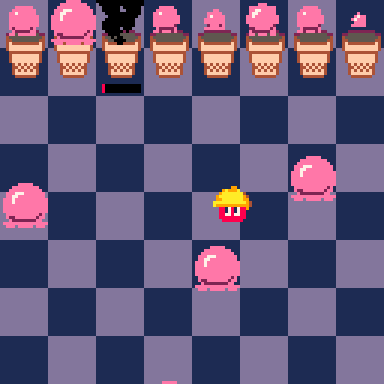

# Dimensional Delights
Maintain the ice cream portals so you can explore the depths of the ice cream dimension! Don't delve too greedily though...the unknown is not always great

Play it now on [itch.io](https://minimechmedia.itch.io/dimensional-delights)

## Controls
* Mouse / Arrow Keys - Move player

# About
Created for [TriJam 278](https://itch.io/jam/trijam-278/entries)  
Theme: The great unknown  
Development Time: 5 hours  

Also submitted to Summer Game Jam 2024  
Theme: 0 Days since Last Accident  

Source code available on [GitHub](https://github.com/MiniMechMedia/pico8-games/tree/master/carts/dimensional-delights)

## Acknowledgements
Inspired by the Neopets game [Ice Cream Machine](https://www.neopets.com/games/game.phtml?game_id=507)

Music is from [Gruber](https://www.lexaloffle.com/bbs/?uid=11292)'s [Pico-8 Tunes Vol. 2](https://www.lexaloffle.com/bbs/?tid=33675), Track 2 - Need for Speed, Track 10 - Dimensional Gate  
Licensed under [CC BY-NC-SA 4.0](https://creativecommons.org/licenses/by-nc-sa/4.0/)

