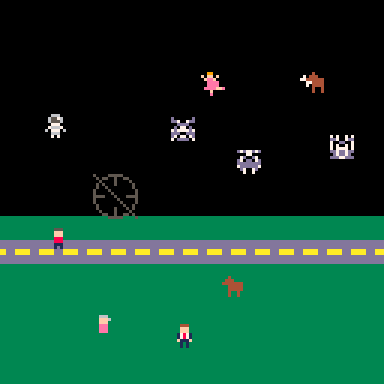

# Dream Sense
Monsters from the dream world have disguised themselves and invaded the real world.
Luckily you are a psychic.

Your dream sense allows you to look into the dream world.
Use your psychic blast power to blast monsters away. This only works in the real world

Play it now on [itch.io](https://caterpillargames.itch.io/dream-sense)

* Mouse - Move crosshairs for your psychic blast
* Left Click / X - Psychic blast
* Right Click / Z - Toggle dream sense

## Hints
* Don't psychic blast normal people!
* If you are only partway through turning your dream sense off you can still psychic blast the real world part of the screen

# About
Created for [TriJam 167](https://itch.io/jam/trijam-167/entries)  
Theme: Heightened senses  
Development Time: 3h 29m 4s  

Also submitted to [MiniJam 105](https://itch.io/jam/mini-jam-105-dreamy)  
Theme: Dreamy  
Limitation: Every playthrough is unique  

Source code available on [GitHub](https://github.com/CaterpillarGames/pico8-games/tree/master/carts/dream-sense)

<!--TODO ponder metadata-->

