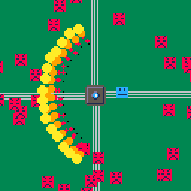

# Firewall Fiasco
Malicious programs are trying to breach the mainframe core!
Hold them off as long as you can using your firewall blast!

Play it now on [itch.io](https://minimechmedia.itch.io/firewall-fiasco)

## Controls
* Arrow Keys - Move
* Z - Shoot firewall blast
* X - Start a new game at game over

# About
Created for Winter Game Jam 2023  
Theme: Delay the Inevitable  

Source code available on [GitHub](https://github.com/CaterpillarGames/pico8-games/tree/master/carts/firewall-fiasco)

## Acknowledgements
Music is from [Gruber](https://www.lexaloffle.com/bbs/?uid=11292)'s [Pico-8 Tunes Vol. 2](https://www.lexaloffle.com/bbs/?tid=33675), Track 1 - Into the Belt  
Licensed under [CC BY-NC-SA 4.0](https://creativecommons.org/licenses/by-nc-sa/4.0/)

