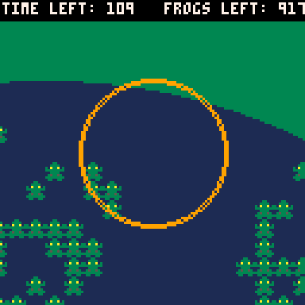

# Frog Teleporter
The frogs are too overpopulated. Use your frog teleporter to send them to a different planet
You only have enough power to run the frog teleporter for two minutes. Get all the frogs before
you run out of power.

Play it now on [itch.io](https://caterpillargames.itch.io/frog-teleporter)

## Controls
* Mouse - Aim frog teleporter
* X - Play again

# About
Created for [TriJam 169](https://itch.io/jam/trijam-169/entries)  
Theme: Overpopulation  
Development Time:   

Also submitted to [MiniJam 106]()  
Theme: Frogs  
Limitation: Limited Time  

Source code available on [GitHub](https://github.com/CaterpillarGames/pico8-games/tree/master/carts/frog-teleporter)

## Acknowledgements
Music is modified version of [Gruber](https://www.lexaloffle.com/bbs/?uid=11292)'s [Pico-8 Tunes Vol. 1](https://www.lexaloffle.com/bbs/?tid=29008), Track 11 - Puzzles. 
Licensed under [CC BY-NC-SA 4.0](https://creativecommons.org/licenses/by-nc-sa/4.0/)

