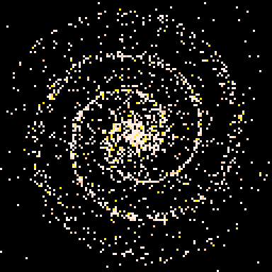

# Galaxy Tweet
A galaxy simulation inspired by [https://en.wikipedia.org/wiki/Density_wave_theory](Density Wave Theory).

This cart is tweetable at just 277 characters
```
::_::
cls()
srand()
for i = 1, 100 do
	pset(rnd(128),rnd(128),7)
end
for i = 1, 1800 do
	r=rnd(50)
	p=r/30
	a=rnd() - t()/(2+r*r/50)
	x = r*cos(a)
	y = r *1.3 * sin(a)
	pset(64 + x * cos(p) - y*sin(p), 64 + x * sin(p) + y * cos(p), rnd({7,7,7,7,7,7,7,15,10}))
end
flip()
goto _
```

[](https://caterpillargames.itch.io/galaxy-tweet)

Play it now on [itch.io](https://caterpillargames.itch.io/galaxy-tweet)

## Controls
None


## About


Source Code: On [GitHub](https://github.com/CaterpillarGames/pico8-games/tree/master/carts/galaxy-tweet)


