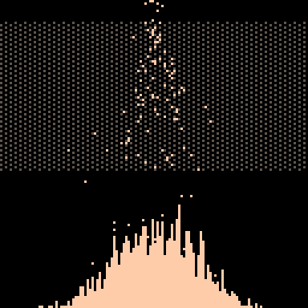

# Galton Board Tweet
[Galton Board](https://en.wikipedia.org/wiki/Galton_board) simulator tweet cart


[](https://minimechmedia.itch.io/galton-board-tweet)

Leave a comment on [itch.io](https://minimechmedia.itch.io/galton-board-tweet)

This cart is tweetable at just 277 characters.

## Source
Remix it on [pico-8-edu.com](https://pico-8-edu.com/?c=AHB4YQHNAWbrwd0nH-8ID-AAu3c32RucXnXvcHyQNAbXOxxzyzVFsrUQvMELLBRl097-Aibos4XUEs-QBWXxEM_w09XFRqohYIGhIqkfYskbSROU9XlnBYab2dhaiRREBET0g4Iurqrr1AeyjTRsx6KgqRayrMqyMmuqrFIlG1IlClSJzlEaz1CQX-gWr7HQrL1EsnfcyENERTcXtEvBOxRBVJ2WdEF7W1VWZVcNVStRJBMwETaPEmXl5FbW3HdlkRRXziRHpnFo2QVLBFunpuFSWS6MvEL3DjsmGZ3cm476gf4xopFm3gP7PkirYmo-q6vFk29-g90dl0gF7WwuTu-t5CsCIhf0G9nw3Myl2f5kHEVTE3UUhZEsQXSvVEG6sbQ2ohQwWsd5KBiSywpcu1etzBT7s01VFEphywdsbl4xc_946JO4uWBhYeyApc3Fshsp98pufMJJ8mPpYDOUTcXZaLGyDA==)
```lua
p={}i=0k=128f=fillp::_::if(i==k)flip()cls()i=0
f(░)line(i,9,i,70,5)f()line(i,k,i,k-@i,15)
p[i]=p[i]or{x=-k,y=0,v=0,w=0,r=rnd,o=_ENV}
_ENV=p[i]pset(x,y,15)g=r(8)w+=.1x+=v
y+=w
if(y>128)poke(x,@x+1)x,y,v,w=60+g,g/5,0,0
if(y>9and y<70and g<2)v=cos(g)/2w=sin(g)/2
_ENV=o
i+=1goto _
```

## Explanation
Remix it on [pico-8-edu.com](https://pico-8-edu.com/?c=AHB4YQraBerrwd0nH-8ID-AAu3c32RucXnXvcHyQNAbXOxxzyzVFsrUQvMELLBRl097-Aibos4XUEs-QBWW5sRFF_gEz5Ub8DjOmSJrgGeLrrgoMN7PRD0TSIcohwkFBF1fVcbID2UAatgtR0FQbWVZlWZk1VVbJkc3IEQVyREojG9GA1EBXz1TJTFxFUWqIJoymsqTK8pWtsgzDppjJYnWCjUeoiqwM2mwom1EUiFayuFcQGZjI3LEQv0QbSxw8w0C6UdcjyiXSIrktiixZWJIJqJK2lg4uBgbaWIB0pW2CYkFhxC3RhHhBelm6VFdhMyBIFu0VYRvGK0leuSM3gw6BfnEnllBVG3G90KaSC_FDLFVh2ZXmeokmbWQE0lrLRIRgIbaN9IkUcZlGC1GxInmylOkVdN2O6sFOujNQL4Xhimpgnkg0zCglpE3aNaV4ilxSNLEwkpZVK5AiapK1oYia8rgWxJYGJAV0VPTTsXDlW7yGcybyVtpgpd7Jp-psJVnow8mq32zeolk9cLXarIowDWaq2eApikByqb5OHGJlR4tlQrphTZWhmrksz0QE_pHZkZEzzREKInQTqgaFZJjMQ6yLIHAwVG_KUcxIBywMrDpCBGpB5EE9pRJ-Cbsgmwmz_5KNYOpAd5RdHIRT4UAa5lUeRdIkeZvrx4glDagPSBApOJbRrO5lXpePkkbeafKdQ4ukmFlK7gxdEYgHK9BoXIwMji0pwEovK4cOdR6YvzZu5lrhIMmM5ajcSl5DzElXbV1ERF56Kj9gak9hYuwlyreYNEm5si5ioB3Ortn0QrGphDQdC0ikJ_yrhFk76dTGo2sxGujTyqfIWU8oNOiLieQoPYzpQqT1ATs70pfl0FwmIZPHcveRuhQmy5JKjitKZpU3Eql8CGH0O8JbQbxrl3KkHhhRM5Nb0tTtCz_l_jRy2Bty-VApzwVRL73-R8EmTUaCgU50p4qAImBPRkZw-JC-aJJ_RXlsIFYP1OoR-ygO2Kht0G7Iri0Ib2jNpOFGHsl3yHEMSOUpfhQzoc6QzMQBU5sDG7WKxVRmEqfotu2IrE3tCXasDEhfzQR1Egj97mxMiFgroRZRuiGuqJAhYpKqD3QrghNyXys6C1sDC3pXWWfe-avPfwZ35Au98vgxsZJsrBQDsfKOosNEF0jjREPiAwPNxMpCm9ehfIiol1EmpDYoIWwrLHe2GlGepbG9cELjZy-Z2xCCgJKgtueAsEzRQ6JHfUnfQEpuLdP2GNM_WMsnNiy3VGiqaHCBQJDSTa0T5KRsXcZkxTXFgN7HeryUyefmAhv5gvyHCkWdr4woqyOY0rjgiJDGGNXWQplq_uRhJpWhRaLaEEiVLC0kAzdoeLUdM4VIsdRtJjjVd9IdfZ7n2xtVc2y-si0TDo29sOpmui5sIncklXvSLeV_LG3sqNP-rYMATUKyk-MbdtgkdDYAw3BoaOULrBZWrwFFeFdEP-aGxBDmu5l4R_uPh8KU9Le4MVoKy9aTc-q4MB_kN6qRMFMPL0wIKcJEKBiE7Us56R1PBPIrWxOCNgdHG5OjxSUXNFWBUcHtoJ6jhi9ChfS9mJ04--TbgineCZvpx9Jjm6HFTKxCd_Hkbiwn93BlS8AeUAtiKKZdoUwyGV6x4ROxEPl0jHUjExroPCSVaxY7E4ycj6Z1yXZ1uZuu6xZXpKmGIt0vRYJwZUIsQr8iWuo0eppoO9Ely-suUFFMYv1wNDospYZQVIyNDOTpeDu6EXVydXUfRep5jaJfli9ManQoccSGS5qwxxexOEo1LEbHd7aW13RCpoSZqERsZWWsmOuSNJ-KhQTD6j0UwxO2G6okYxIFIj96Qhp5GiYjO_pOwYbqJKEI4FiIxACHBIkkt22rIhNzn0gST0hCzdVJM5F1GhYKhuQkJsVRHDPT6nCIV4mI-8fFuyLiYqQASYKhbmO2dsvcvjCB23Qlpe3QI-xSXpzb2MCo0MmtjT5JJubCqajsizDlhzCoCdxPluv1bkwR4wI=)
```lua
-- The main idea is that we simulate a bunch of falling particles
-- which may get jostled on the way down. When a particle hits
-- the bottom of the screen, record that event by incrementing
-- the memory location equal to the x coordinate where the
-- particle landed. Simply draw a histogram where each bin height
-- is the number of hits at that x coordinate.

-- List of particles
p={}
-- Our index variable
i=0
k=128
f=fillp
::_::
-- We're doing an inline "for i=0,127 do" loop. So
-- we manually reset i and call the functions we need
if(i==k)then
  flip()cls()i=0
end
-- Draw one line of the peg board 
f(░)
line(i,9,i,70,5)
f()
-- draw the ith bar of the histogram
line(i,k,i,k-@i,15)
-- Initialize the list with particle objects
p[i]=p[i]or{
  -- Initialize position and velociy.
  -- Position is initialized offscreen, and particle will
  -- fall like normal. When it reaches bottom of screen,
  -- let the regular particle recycling code respawn
  -- the particle in the right location. Particles will
  -- hit the bottom of the screen at different times, so
  -- the particles trickle in onscreen even though they
  -- are all instantiated at the same time
  x=-k,y=0,vx=0,vy=0,
  -- We will be losing access to the rnd function in the next
  -- line, so stash it. Similarly, need to stash _ENV since
  -- we will be overwriting it soon
  r=rnd,old_env=_ENV}
-- _ENV sets the global lookup table. From here on
-- out any references like x or y behave like we are
-- doing p[i].x or p[i].y
_ENV=p[i]
pset(x,y,15)
-- This random value will be used for a variety of purposes later on
g=r(8)
-- apply acceleration (gravity)
vy+=.1
-- apply velocity
x+=vx
y+=vy
-- If particle has hit the bottom of the screen...
if(y>128)then
  -- increment the xth bin in the histogram
  poke(x,@x+1)
  -- reset the particle back to the top of the board
  -- in a semi-random position, and 0 out velocity
  x,y,vx,vy=60+g,g/5,0,0
end
-- If we are in the peg section of the screen
-- then with a 25% chance (g<2), simulate a collision
if(y>9and y<70and g<2)then
  -- Point the particle's velocity in a random direction.
  -- We don't have enough characters left to calculate speed
  -- so we don't preserve energy. Luckily this still looks
  -- convincing.
  -- Note that Uniform(0,8) conditioned on g < 2, means
  -- g ~ Uniform(0,2). So feeding that value to cos and sin
  -- corresponds to a random angle between 0 and 720 degrees
  -- which is equivalent to a random angle between 0 and 360 degrees
  vx=cos(g)/2
  vy=sin(g)/2
end
-- Reset global lookup table so we can access p, i, etc. again
_ENV=old_env
i+=1goto _
```


## About


Source code available on [GitHub](https://github.com/MiniMechMedia/pico8-games/tree/master/carts/galton-board-tweet)

