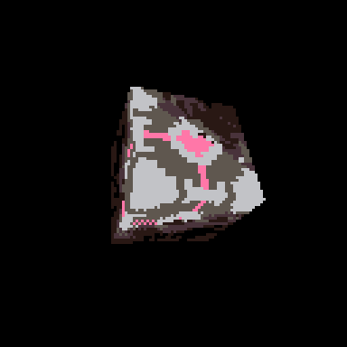

# Graphics with PICO-8
A supplement to a presentation on building a graphics engine in PICO-8. View the presentation [here](https://github.com/MiniMechMedia/pico8-games/tree/master/carts/graphics-with-pico-8/presentation/Graphics-With-PICO-8.pdf).

Play it now on [itch.io](https://minimechmedia.itch.io/graphics-with-pico-8)

## Controls
* Left Arrow Key / Right Arrow Key - navigate slides

# About

Source code available on [GitHub](https://github.com/MiniMechMedia/pico8-games/tree/master/carts/graphics-with-pico-8)

