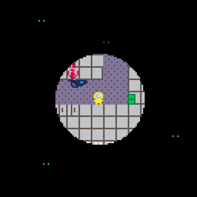

# Health Inspectre
You are an inspector examining the basement of a condemned office. 
You discovered something worse than the numerous OSHA violations - ghosts!

Make your way to the basement's exit, without getting caught by the ghosts!
If a ghost catches sight of your flashlight it will come closer, but you can hide 
in the darkness safely. But if the ghost gets too close and _you_ catch sight of 
_it_, it will chase you even in the dark.

Play it now on [itch.io](https://caterpillargames.itch.io/health-inspectre)

## Controls
* Arrow Keys - Move
* X - Toggle flashlight

## Hints
If you get stuck, here is a [map of the basement](https://github.com/CaterpillarGames/pico8-games/blob/master/carts/health-inspectre/screenshots/map.png)

# About
Created for [TriJam 123](https://itch.io/jam/trijam-123/entries)  
Theme: Hide or get caught!  
Development Time: 3h 26m 55s  

Source code available on [GitHub](https://github.com/CaterpillarGames/pico8-games/tree/master/carts/health-inspectre)

