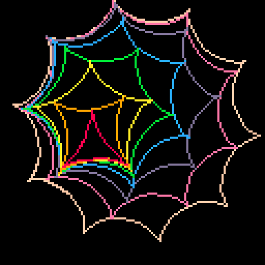

# Hypocycloid Tweet
[Hypocycloids](https://en.wikipedia.org/wiki/Hypocycloid) are curves that 
are formed similarly to using a [Spirograph](https://en.wikipedia.org/wiki/Spirograph) toy
An interesting property they have is that a hypocycloid with n cusps (the pointy parts) 
can move around inside a hypocycloid with n+1 cusps and maintain contact between the inner
cusps and the outer curve.
<a href="https://johncarlosbaez.wordpress.com/2013/12/03/rolling-hypocycloids/"><cite>https://johncarlosbaez.wordpress.com/2013/12/03/rolling-hypocycloids</cite></a>

Play it now on [itch.io](https://minimechmedia.itch.io/hypocycloid-tweet) or remix it on [pico-8-edu.com](https://www.pico-8-edu.com/?c=)

This cart is tweetable at just 272 characters.

<pre><code>c=cos
s=sin
l=line
::_::
cls()
k=-10
a = t()/20
::h::
for i=1.1,0,.1/k do
x=k*c(i)+c(k*i)
y=k*s(i)+s(k*i)
for k2=k-1,-10,-1 do
mx=c(a+.5/k2)
my=s(a+.5/k2)
ax=c(a*k2)
ay=s(a*k2)
x,y=x*mx-y*my+ax,x*my+y*mx+ay
end
l(6*x+64,6*y+64,6-k)
end
l()
if(k<-2)k+=1goto h
flip()
goto _</code></pre>

## Explanation
<pre><code>c=cos
s=sin
l=line
::_::
cls()
k=-10
a = t()/20
::h::
for i=1.1,0,.1/k do
x=k*c(i)+c(k*i)
y=k*s(i)+s(k*i)
for k2=k-1,-10,-1 do
mx=c(a+.5/k2)
my=s(a+.5/k2)
ax=c(a*k2)
ay=s(a*k2)
x,y=x*mx-y*my+ax,x*my+y*mx+ay
end
l(6*x+64,6*y+64,6-k)
end
l()
if(k<-2)k+=1goto h
flip()
goto _</code></pre>

## About

Source code available on [GitHub](https://github.com/CaterpillarGames/pico8-games/tree/master/carts/hypocycloid-tweet)

## Acknowledgements
Based on this [animation by Greg Egan](https://commons.wikimedia.org/wiki/File:Rolling_Hypocycloids.gif).  
See the [Azimuth blog](https://johncarlosbaez.wordpress.com/2013/12/03/rolling-hypocycloids/)
for more info

