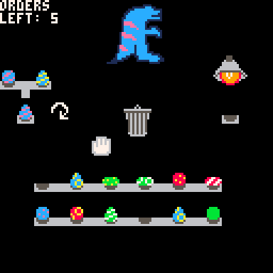

# Kaiju Companions
It took everything humanity had to defeat the kaiju, but death isn't the end
for them... Through our patented DNA recombination technology, you can 
own a miniature clone of your very own kaiju, available in all varieties
of shapes, colors, and patterns! Here at Kaiju Companions, we make the 
horrible adorable!  
  
Cross breed the eggs to match the kaiju that a customer has ordered.  

Play it now on [itch.io](https://caterpillargames.itch.io/kaiju-companions)

## Controls
* Mouse - Move cursor
* Left Click - Pick up / place eggs. Press refresh button

# About
Created for [TriJam 122](https://itch.io/jam/trijam-122/entries)  
Theme: Transformation / Micro Things  
Development Time: 3h 8m 59s  

Also submitted to [MiniJam 81](https://itch.io/jam/mini-jam-81-kaiju)  
Theme: Kaiju  
Limitation: Death isn't the end  

Source code available on [GitHub](https://github.com/CaterpillarGames/pico8-games/tree/master/carts/kaiju-companions)

