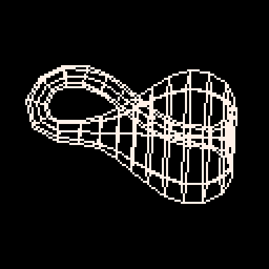

# Klein Bottle Tweet
A [Klein bottle](https://en.wikipedia.org/wiki/Klein_bottle) non-orientable surface
that is related to the Möbius strip.

This can be rendered so compactly thanks in part to the [Euler spiral](https://en.wikipedia.org/wiki/Euler_spiral)


[](https://minimechmedia.itch.io/klein-bottle-tweet)

This cart is (almost) tweetable at just 401 characters.

Leave a comment on [Twitter](https://twitter.com/MiniMechMedia/status/1759323397199217082) or [itch.io](https://minimechmedia.itch.io/klein-bottle-tweet)

## Source
Remix it on [pico-8-edu.com](https://pico-8-edu.com/?c=AHB4YQJKAb7rwe3H3337_bN33-8IQddVzTs0QdIYXO9wyiW3FMlSHzxB3xdl017-Aia4P7s-tcQzdEFZPMQrjHR1sZGuRKUFHiGq8ocY8kbSBG1_3lmB4XZG8pVIQURARD8o6OKqum6nnyhX6jZ-iChoqizLqixrs6bKKlWiUpUsUCW6R2k8Q8HSiRNbwWnHBXPXhXthW153Xlp0L9HFzYQv2uQlqrd4jWjNDkNVsbZTFVFRjUZPkcWrb1H2Ry4FI1dupfFeeWL7DneeWc7NxcFuduZLDHTd5shiOTG15Jsrd8JTi3x-Z6abGK6nsr2pMu0vzerRh6heopqdToqp0cGBYmBgcmBzuS0mzLJrlseIYiOshMuHVNVAuiwX0A5tTkkGZStSAenIysRCXmmETXZxpBoSDq-NdQtdt_TV-e2yuyF4iyJItu4I58aUixaVi6aEC67IVQhWxw_YWRkpD8iyKJ21x-BwOeiWSL8kvTcN0gGdoKzxzPDAERuZyMAVekNDY9mOTYbyaK0Mli7YnMqW6qYosmxyo6o6HywuNFu7QXvBAbsDdqmr2PS7oZUoOmFlZUOd4IztrWJ9eQ0=)
```lua
d=.0024415
x=-.3626
y=0
r=.05
q={}
i=0
c=cos
s=sin
for j=0,4427do
a=(j\9*d-.7789)^2-.1068
if(j\9%41<1)b=j%9/8o=s(b)i+=1q[i]={x=x-r*o*s(a),y=y+r*o*c(a),z=r*c(b)}k=r-y q[i+108]={x=-x,y=k*o,z=k*c(b)}
x+=c(a)*d/9
y+=s(a)*d/9
end
::_::
cls()
for i=0,441do
p=q[i%25*9+i\25+1]or q[9-i\25]
if(i>225)p=q[i-225]
a=t()/9
m=c(a)
n=s(a)
line((p.z*n+m*m*p.x-m*n*p.y)*100+64,(n*p.x+m*p.y)*100+64,7)
end
flip()
goto _
```

## Explanation

```lua
-- Let's draw a Klein bottle! It will consist of 2 main pieces,
-- the neck and the base. For both, we will use a curve that's
-- shaped like a question mark `?`. For the neck, we will form
-- a pipe surface by sweeping a circle through the question mark.
-- For the base, we will form a surface of revolution by rotating
-- the question mark around a straight line.

-- To generate the question mark curve, we will use a Clothoid aka
-- Euler spiral aka Cornu spiral. This curve is parameterized by
-- the Fresnel integrals, \int_0^L cos(l^2)dl, \int_0^L sin(l^2)dl
-- This curve has some very convenient properties:
-- * It is naturally parameterized by arc length, so
--   * If we calculate points at regular intervals of our loop index, 
--     they will be equidistant along the curve, which looks nice.
--   * The derivative (tangent vector) will already be normalized to 
--     unit length, saving some characters
-- * It is defined by integrals, so
--   * We can reuse results in subsequent loop iterations
--   * We get the derivative (tangent vector) for free
-- * The curvature of the curve is a linear function of arc length, so
--   * We can build a train track that follows the curve and passengers
--     will not experience jarring acceleration. Just kidding, we don't
--     need that use case. But the curve does look visually appealing
--     and smooth.

-- We only need a small segment of the Clothoid's infinite extent to get
-- our question mark curve. We choose endpoints so that a line connecting
-- them is a bitangent (tangent at both points). This makes it so the neck
-- smoothly flows into the body. Then we rotate so that the endpoints lie
-- on the x-axis, making it easier to calculate the surface of revolution 
-- for the base. Then we translate so the endpoints are equidistant from
-- the origin, allowing us to re-use the neck curve for the body curve.

-- A delta of of arc length
dl=.0024415
-- x,y will be our position on the curve. Initialize to first endpoint
x=-.3626
y=0
-- Radius of the neck of the bottle
r=.05
-- Holds the x,y,z of each point in the mesh
mesh={}
-- Index variable for the points list
i=0
-- Here is where we calculate the curve and the mesh based on that

-- 4427 happens because we are inlining a couple of loops here
-- Mesh will consist of 12 "slices" of the bottle
--   (Actually there are 24, but we calculate 2 slices at a time)
-- Each slice will be an octogon of 9 points (first and last overlap)
-- We take a slice every 41 iterations to preserve accuracy of the curve
-- 12*9*41 = 4428, and this is a 0-based loop
for j=0,4427do
-- (Signed) arc length of the curve so far. Offset by -.7789 since that is the
-- arc length corresponding to our starting point
l=j\9*dl-.7789
-- Value to use when calculating the next part of the Fresnel integrals
-- We offset by -.1068 to align the bitangent with the x-axis
a=(l)^2-.1068
-- Calculate the tangent vector
tx=cos(a)
ty=sin(a)
-- If this is the 41st iteration since our last slice, take a slice
if(j\9%41<1)then
    -- To take a slice, we need to take where we are on the curve and
    -- * for the neck, form a circle centered at that point and perpendicular
    --   to the tangent of the curve
    -- * for the body, form a circle that intersects where we are on the curve,
    --   centered on the x-axis, and perpendicular to the x-axis

    -- The angle around the octogon for the slice
    theta=j%9/8
    o=sin(theta)
    i+=1
    -- Forming a slice of the neck. Calculate a circle centered at where
    -- we are on the curve, and perpendicular to the tangent of the curve
    mesh[i]={
        -- Note that the normal convention would be to use cos, cos, sin.
        -- But using sin, sin, cos makes it easier to draw the bottle later on
        -- Note that we turned the tangent vector (tx, ty) into a normal vector by
        -- doing (-ty,tx)
        x=x-r*o*ty,
        y=y+r*o*tx,
        z=r*cos(theta)
    }
    -- Forming a slice of the body. We are rotating the curve around the
    -- x-axis, so calculate a circle with radius y, centered on the x-axis
    -- and perpendicular to the x-axis.
    -- Except that would result in a 0 width at the ends, so we actually need
    -- to offset the radius by the radius of the neck.
    bodyradius=r-y
    -- Add 108 because there will be 9*12-108 points in the neck when we are
    -- done. And we want the body points to come right after.
     mesh[i+108]={
        -- The curve of the body is actually a mirror image of the curve
        -- of the neck. Achieve this by doing -x
        -- Note again that we are using sin, cos instead of cos, sin to make
        -- it easier to draw the bottle later on
        x=-x,
        y=bodyradius*o,
        z=bodyradius*cos(theta)
    }
end
-- Add the tangent vector times out delta of length. Because we inlined the loop
-- for calculating the curve with the loop for calculating the slice, we are
-- doing this 9 times more than we want. So we can just add a ninth of our delta
-- to compensate.
x+=tx*dl/9
y+=ty*dl/9
end
-- We now have our mesh populated. Time to draw the lines connecting the vertices.
-- The strategy is to do 2 passes.
-- First we draw a line connecting every pair of points that has an index of 9 away.
-- This connects corresponding points of each slice, drawing the "lines of longitude".
-- Then we connect every adjacent point (with respect to the array indices) with a 
-- line. This will result in drawing all the "lines of latitude". 
-- Technique borrowed from https://x.com/MunroHoberman/status/1335957716053987328?s=20
-- While we're at it, we will also rotate each point around an angle parameterized by
-- time, to animate a rotation.
::_::
cls()
-- We do both passes in one loop. The second pass handles all 24*9=216 points in the bottle.
-- The first pass does the same, except we need to draw the first slice twice, so
-- 25*9=225 points. This gives us a total of 441 iterations.
for i=0,441do
-- The first pass can be thought of 9 smaller passes, one for each vertex of our octogon.
-- 
-- i%25 tells us which slice we are on. Then *9 to get the base index for that slice (index of 
-- the first point in that slice).
sliceindexbase=i%25*9
-- Calculate which vertex of the slices we are working with
sliceoffset=i\25
-- Remember how we said we needed to draw the first slice twice? This `or` makes
-- it so we loop around back to the first slice. You might think it should just be
-- mesh[sliceoffset], but this would result in the lines criss-crossing.
-- This is actually a consequence of the non-orientability of the Klein bottle. Taking
-- the modular inverse fixes it though. This is also the reason we used sin,cos for
-- calculating slices instead of cos,sin. The correction is much simpler this way.
    p=mesh[sliceindexbase+sliceoffset+1]or mesh[9-sliceoffset]
-- By now, our point p might be nil or just wrong, since we might actually be onto the second pass.
-- That's ok, just overwrite it if we are. The second pass, logic is much easier. Just loop through each point.
    if(i>225)p=mesh[i-225]
-- Almost there, just need to apply a rotation. Here is our angle. The 9 is unrelated to our octogons.
    a=t()/9
-- This calculates a composition of rotations along 2 axes
    line((p.z*sin(a)+cos(a)*cos(a)*p.x-cos(a)*sin(a)*p.y)*100+64,(sin(a)*p.x+cos(a)*p.y)*100+64,7)
end
flip()
goto _
```


## About


Source code available on [GitHub](https://github.com/MiniMechMedia/pico8-games/tree/master/carts/klein-bottle-tweet)

