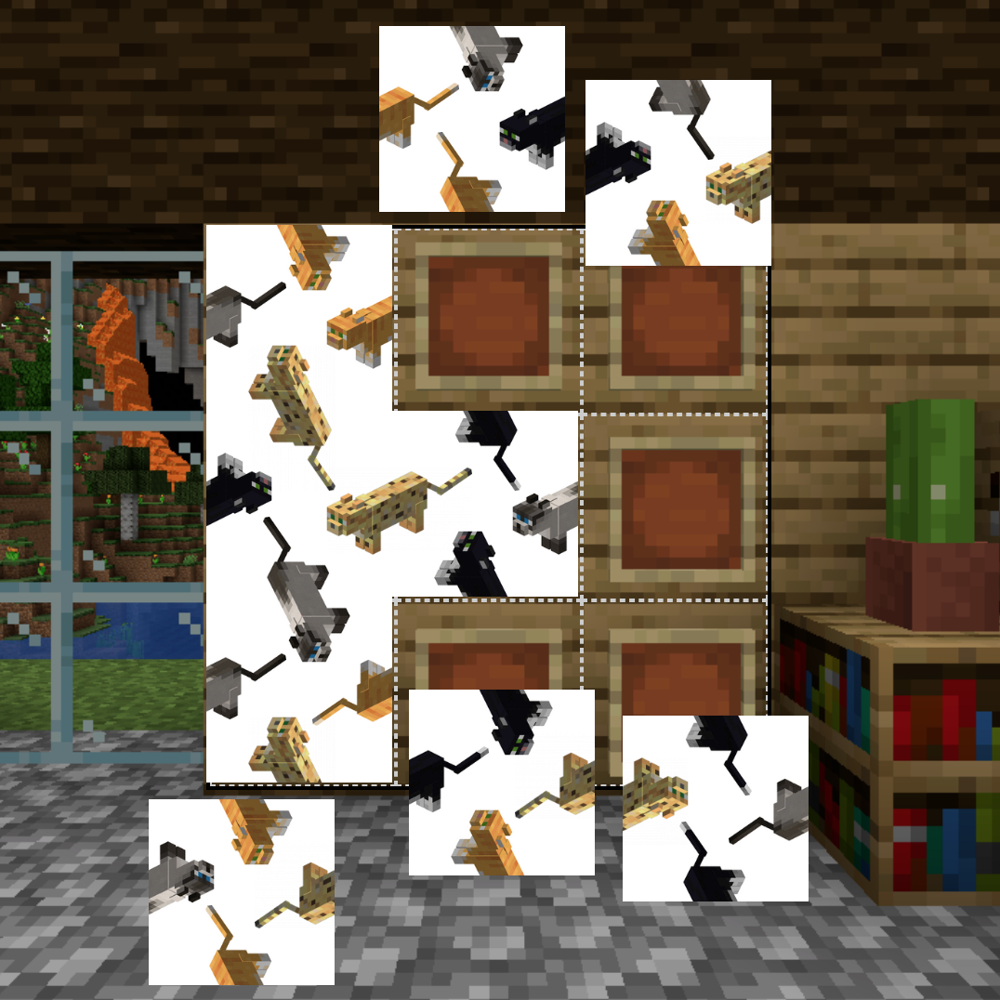

# Minecraft Cat Puzzle
Move and rotate the tiles until all adjacent edges match.
This game is based on a real Minecraft mini-game built from placing 
custom maps in item frames. Maps are available to download and import into your own Minecraft world!

Play it now on [itch.io](https://minimechmedia.itch.io/minecraft-cat-puzzle)

## Controls
* Mouse - Drag and drop pieces. Click to rotate pieces.

## Hints
If you get stuck, here is what the puzzle looks like when solved: [Solution](https://github.com/MiniMechMedia/pico8-games/blob/master/carts/minecraft-cat-puzzle/images/solution.png)

# About

Source code available on [GitHub](https://github.com/MiniMechMedia/pico8-games/tree/master/carts/minecraft-cat-puzzle)

## Acknowledgements
* Based on this puzzle https://imgur.com/NbLum43 (Spoiler alert! This image shows the solved puzzle)
* https://mc-map.djfun.de/ used to convert PNG images into Minecraft map items

