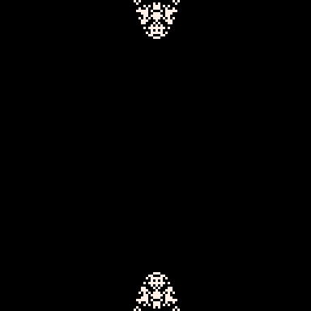

# Pascal-Rorschach Tweet
This cart calculates successive rows of Pascal's Triangle 
in binary (and then mirrors the result vertically for more viewing potential). 
This results in some surprisingly discernible images...or
maybe I've just been looking at pixel art too much.

Play it now on [itch.io](https://caterpillargames.itch.io/pascal-rorschach-tweet) or remix it on [pico-8-edu.com](https://www.pico-8-edu.com/?c=AHB4YQEoAOA3H-8G2_P9C7zA-adndzzENccfkx9yT54-wV1tM7DQv8JAelFcFjfV7VnB6UWQvMDGIfH5_cZEdFccdNErpF34BGUzcNOBS3tlW9X2cddYkdf1Ur1RBclZY6fZYGZxpRvMxmbCwbXuBVJfJMFQWfrIOi9hjcVF52bBE2RTb6A9MDBQLjly0ZHHbXge4apjum6n34zyJwjaItiwbjAQHVc9RtNUTdQ0nppbW5pz6TNERTWxoHYwMBUEA8XOmA1GdvPzZqbeYM4OW65oNgRDJmUNtBHmBkeLxW0=&g=w-w-w-w1HQHw-w2Xw-w3Xw-w2HQH)

This cart is tweetable at just 274 characters.

<pre><code>cls()
poke(0x5f2c,6)
n=0
pset(63,0,7)
::_::
if (btnp(4)) printh(n,'@clip')
if btnp(5) then
	n+=1
	for x=0,127 do
		c=0
		for y=0,63 do
			a=pget(x,y)
			b=pget(x-1,y)
			pset(x,y+64,a^^b^^c)
			c=a&b|a&c|b&c
		end
	end
	memcpy(0x6000,0x7000+(n%4)\3,0x1000)
end
flip()
goto _</code></pre>

## Controls
* X - Calculate next generation
* Z - Copy current generation number to clipboard (i.e. how many times you have pressed the X key)

## About

Source code available on [GitHub](https://github.com/CaterpillarGames/pico8-games/tree/master/carts/pascal-rorschach-tweet)

## Acknowledgements
Inspired by [this animation](https://en.wikipedia.org/wiki/Pascal%27s_triangle#/media/File:Pascal's_Triangle_animated_binary_rows.gif)
on the Pascal's Triangle [Wikipedia page](https://en.wikipedia.org/wiki/Pascal%27s_triangle)

