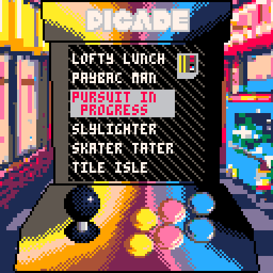

# Picade Simulator
Simulate the experience of playing games on hardware!
Includes 12 games!

Play it now on [itch.io](https://caterpillargames.itch.io/picade-simulator)

## Controls
* Up Arrow Key / Down Arrow Key - Move selection up and down
* X - Choose game
* P - Pause menu. When playing a game use "Back to Picade" option to get back to main menu

# About

Source code available on [GitHub](https://github.com/CaterpillarGames/pico8-games/tree/master/carts/picade-simulator)

## Acknowledgements
Based on the [Picade](https://shop.pimoroni.com/products/picade) mini arcade cabinet by Pimorini

Music on menu is from [Gruber](https://www.lexaloffle.com/bbs/?uid=11292)'s [Pico-8 Tunes Vol. 1](https://www.lexaloffle.com/bbs/?tid=29008), Track 5 - Ice. 
Licensed under [CC BY-NC-SA 4.0](https://creativecommons.org/licenses/by-nc-sa/4.0/)

Arcade background image generated with [Dalle-2](https://openai.com/dall-e-2/)

Visit [game pages](https://caterpillargames.itch.io/) for acknowledgements for individual games

