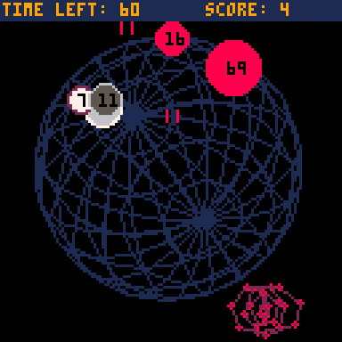

# Prime Time
Quantum computers remove the limits of classical computers.
You are in control of Shor's algorithm. Your mission is to shoot numbers to factor them. 
Rack up points by shooting as many prime numbers as you can before the time runs out.

Play it now on [itch.io](https://minimechmedia.itch.io/prime-time)

## Controls
* X - Shoot
* Arrow Keys - Move

# About
Created for [TriJam 251](https://itch.io/jam/trijam-251/entries)  
Theme: Remove Limits  
Development Time: 2:57:05  

Source code available on [GitHub](https://github.com/MiniMechMedia/pico8-games/tree/master/carts/prime-time)

## Acknowledgements
* Music is from [Gruber](https://www.lexaloffle.com/bbs/?uid=11292)'s [Pico-8 Tunes Vol. 2](https://www.lexaloffle.com/bbs/?tid=33675), Track 3 - Like Clockwork  
Licensed under [CC BY-NC-SA 4.0](https://creativecommons.org/licenses/by-nc-sa/4.0/)
* Sound effects are from [Gruber](https://www.lexaloffle.com/bbs/?uid=11292)'s [Pico-8 SFX Pack](https://www.lexaloffle.com/bbs/?pid=64837)  
Licensed under [CC BY-NC-SA 4.0](https://creativecommons.org/licenses/by-nc-sa/4.0/)
* Background animation is from [Munro](https://www.lexaloffle.com/bbs/?uid=37618)'s [Globe tweetcart](https://twitter.com/MunroHoberman/status/1335947168700575745)  
Licensed under [CC BY-NC-SA 4.0](https://creativecommons.org/licenses/by-nc-sa/4.0/)
* "Algorithm" animation is from [Munro](https://www.lexaloffle.com/bbs/?uid=37618)'s [Tweetcarts](https://www.lexaloffle.com/bbs/?tid=39199), Gyroscopic (with modifications to color and size)  
Licensed under [CC BY-NC-SA 4.0](https://creativecommons.org/licenses/by-nc-sa/4.0/)
* Game loosely inspired by [Shor's Algorithm](https://en.wikipedia.org/wiki/Shor%27s_algorithm)

