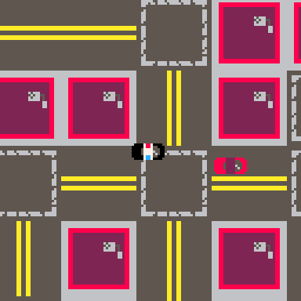

# Pursuit in Progress
Catch the perpetrator! Don't crash into any buildings and don't let the perp out of your sight!

Play it now on [itch.io](https://caterpillargames.itch.io/pursuit-in-progress)

## Controls
* Arrow Keys - turn police car
* X - restart the game when the game ends

## Hints
* Stay on the perp's tail and you will slowly build speed
* You don't have to follow the perp's every move - see if 
you can anticipate their actions and head them off
    * Don't let them get too far away though, or they will escape!

# About
Created for [TriJam 119](https://itch.io/jam/trijam-119/entries)  
Theme: Law and Order  
Development Time:   

Source code available on [GitHub](https://github.com/CaterpillarGames/pico8-games/tree/master/carts/pursuit-in-progress)

## Acknowledgements
Music is from Gruber's [Pico-8 Tunes Vol. 2](https://www.lexaloffle.com/bbs/?pid=picotunes2)

* Track 7 - Flight of Icarus (chase music)
* Track 4 - Morning Shower (victory music)

Licensed under [CC BY-NC-SA 4.0](https://creativecommons.org/licenses/by-nc-sa/4.0/)

