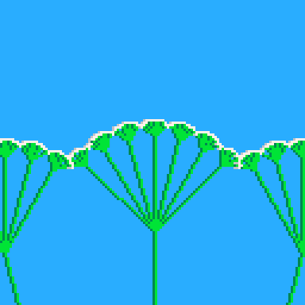

# Queen Anne's Lace Tweet
> If you look closely, you'll see that Queen Anne's lace is 
composed of a cluster of flowers. And if you look even more
closely, you'll see that the cluster is composed of a cluster.
And if you look even more closely...

A tweet cart that does an infinite zoom on a fractal flower
that looks like [Queen Anne's Lace](https://en.wikipedia.org/wiki/Queen_Anne%27s_lace)


[](https://minimechmedia.itch.io/queen-annes-lace-tweet)

Leave a comment on [itch.io](https://minimechmedia.itch.io/queen-annes-lace-tweet)

This cart is tweetable at just 280 characters.

## Source
Remix it on [pico-8-edu.com](https://pico-8-edu.com/?c=AHB4YQHXAWbrwQu8wt3BA6xenQTN_iNUD5BdnkWv8A5NkDQGfIdbTjmmSLYWgkd4goWibNr6CUzwANlAGnhiogvK4iHeYaSri430HaLSAq8QVfnQI3gjaYI2P__swHA7I-lKJCGiICIgFHRxVV2300_UK3WbP0QUNFWWZVWWtVlTZZUsUSlLkhSqJIEq0UFq4xkKnmFlp3XKTnTV1GUvUQwUdbF2WD2UptWNi91WujMT9qdN9QseONDOx9WGujAfq_ulZmlmZS9aGjpy7cCNYitMV7u1kXTwwAvDiXo6XUv35iYHmsGFrXbPCtXElBUGlptmTVZ4wgcTXhhqbbuwZ9yisFYQJGsDcgL9QNEPDTZbY2mzEE-VCxPliEcWt9pmSQJhb25kYCFfaE7cXpgOnqEI4rWheGBSOqCMm9Ujx4soyfImS7pmoIj6mdEdTYZM6aQ5cyXTEBmcmFveqLbK2eVieasK)
```lua
function f(x,y,a,s,d)
if(d<1)pset(x*g,y*g,6)pset(x*g+1,y*g,7)return
for i=-3,3do
b=a+i/24
u,v=x+s*cos(b),y+s*sin(b)
line(x*g,y*g,u*g,v*g,3)line(x*g+1,y*g,u*g+1,v*g,11)f(u,v,b,s/6,d-1,i+4)end
end
g=1
camera(-64,-50)::_::cls(12)f(0,179.9,.25,150,4,1)g*=1.04
if(g>6)g=1
flip()
goto _
```

## Explanation
Remix it on [pico-8-edu.com](https://pico-8-edu.com/?c=AHB4YQUUAuLrwQu8wt3BA6xenQTN_iNUD5BdnkWv8A5NkDQGfIdbTjmmSLYWgkd4goWibNr6CUzwANlAGnhiogvK8hXeIYqaOHmEdKPeeQNTJE3wDvV5ZwWGmxnJFyLtEOkQ5aCgi6vqupl_pdyo23wkCpoqy7Iqy9qsqbJKj6jUI0kKOZJAjkhtZGOqTJJ8K2iG0jaLkuIVoqaukzBrVqKkiSaCd9AviIu6UjQWNFzRDlfaRmmqcdA2nR2GFlrpgjjXP6iapUbiwBtPUQUr-VZQpd1Abp9ootzoJ856idueopipt9qymuk7FyxVawtLp_mSDHZlt5WaYFCaTFxENGypGWtlFbpkqx7YkCzYGRAYibKVvJNcmIhHdiZiOy4tRdlA3pX1ULvVtFPqQldubo3UGzvdynH1zMrYRiM8tuP2nSgRfp03IBLeGxemBgYWmyEVlVz7IBkbWgkXhdTatcVyKezCMQWS5szVE_NiMO3axXIpkztKXbQT7Z54owiL9kG5U2ooDIgoLezEGwNxNCSi4hclh9WJdmR8Y3NEJmlzol4YFRPHXLroy2hhwffSdxFPFhHZtdvm3Ohktro3JJWgUzMWpWPKSWk6lqTTrtfGcKCVkOULyayk_iUcoqP_d8z7G-P_Nnf0wy_R9UNBfFuVhniDQCsq7qfCZmgjzUZqsXhkTSagrDZXT6zIq2-OdlvKClvS7FCi29zVoludiAY2RldSSQYPKSoKSsjm7Qz0ylVbGin9WjpRTWyOLWkLiMtnc0Jop1qSvOjGR4qkLmVDBHcGJUniNRWmoAm2hCpEoLamhtr0yHhpqRX0SAfaLT8EftkOHqIIum5joRtZjvVL64Fo_szhIkq6iSZLumakkEXT3FHgGEmuTAZXi51VcZ_9Rplc03t1XytQhZnOi6lkUrbEw4aLocG9TMtnT7Uk2gq7Qc2NpgvG9XQE9HNoOOb2KB7E2Wg2Vw2Op2oHm00=)
```lua
-- We will draw a fractal that looks like Queen Ann's Lace.
-- We will create the illusion of an infinite zoom.

function flower(x,y,angle,scale,depth)
-- Base case: Draw the flower. It's simply a white pixel and gray pixel for shading
if(depth<1)pset(x*globalscale,y*globalscale,6)pset(x*globalscale+1,y*globalscale,7)return
-- Otherwise, draw 7 copies
for i=-3,3do
childangle=angle+i/24
-- Calculates the endpoint of the stem
u,v=x+scale*cos(childangle),y+scale*sin(childangle)
-- Draw the stem. Draw a bright green line and a dark green line offset by 1 pixel for shading
line(x*globalscale,y*globalscale,u*globalscale,v*globalscale,3)
line(x*globalscale+1,y*globalscale,u*globalscale+1,v*globalscale,11)
-- Recursively draw the rest of the flower at the endpoint
flower(u,v,childangle,scale/6,depth-1,i+4)
end
end
-- Drawing will be scaled by this amount
globalscale=1
-- Allow 0,0 to be drawn at screen coordinates (64, 50)
camera(-64,-50)
::_::
cls(12)
flower(0,179.9,.25,150,4,1)
-- Zoom in 4% every frame
globalscale*=1.04
-- Reset scale at a zoom factor of 6 to cleanly loop
if(globalscale>6)globalscale=1
flip()
goto _
```


## About


Source code available on [GitHub](https://github.com/MiniMechMedia/pico8-games/tree/master/carts/queen-annes-lace-tweet)

