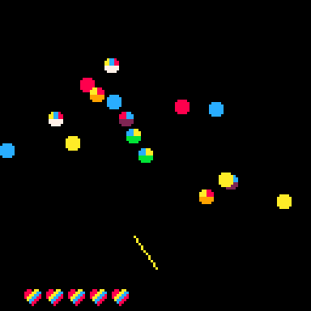

# R.A.I.N.B.O.W.S.
Enemy missiles are inbound. Defend yourself using the Radial Anti-Inbound Non-Ballistic 
Offensive Weapon System.

Shoot down the missiles with a missile of the same color. Hybrid-colored missiles need 
to be shot down with missiles of each primary color (e.g. a green missile must be shot 
with both a blue and yellow missile). Hybrid-colored missiles do more damage if they hit you.

Survive 10 waves to win!

Play it now on [itch.io](https://caterpillargames.itch.io/rainbows)

## Controls
* Left Arrow Key / Right Arrow Key - aim turret
* Up Arrow Key - fire turret
* X / Z - cycle through colors of turret

# About
Created for [TriJam 113](https://itch.io/jam/trijam-113/entries)  
Theme: Rainbow  
Development Time:   

Source code available on [GitHub](https://github.com/CaterpillarGames/pico8-games/tree/master/carts/rainbows)

