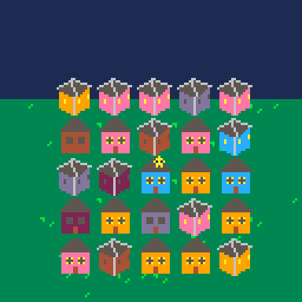

# Slylighter
The star fell out of the sky and hit a bunch of houses when it landed. Now it's too bright to navigate back home. Turn off all the lights to make the other stars come out so you can go home. Features 3 levels of difficulty.

Play it now on [itch.io](https://caterpillargames.itch.io/slylighter)

## Controls
* Arrow Keys - move to a different house
* X - toggle the currently selected house
* Z - skip animation at the beginning
* P - pause menu to access other difficulties

# About
Created for [TriJam 86](https://itch.io/jam/trijam-86/entries)  
Theme: Stars  
Development Time: 2h 59m 57s  

Source code available on [GitHub](https://github.com/CaterpillarGames/pico8-games/tree/master/carts/slylighter)

## Acknowledgements
Based on the game [Lights Out](https://en.wikipedia.org/wiki/Lights_Out_(game)) by Tiger Electronics

