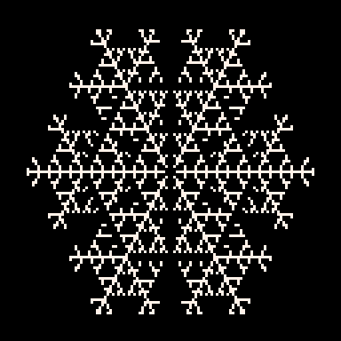

# Snowflake Tweet
Implements a cellular automata that produces a snowflake shape


[](https://minimechmedia.itch.io/snowflake-tweet)


Check it out on [Twitter](https://twitter.com/MiniMechMedia/status/1688316461268295680) or remix it on [pico-8-edu.com](https://pico-8-edu.com/?c=AHB4YQHMAUjrwRvc-wDvcPoD3P0Ax0_-QtcESWPwvsMtpxxTJFMDwRs8wUJRNu39T2CCF8gW0sATK11QFg-xCitdXWykO1FpgUeIqvwhXsEbSRO0_X13BYbbGclXIgkRBREBoaCLq_q8nX6iXKnb-CGioKmyLKuyrM2aKqtkiUtZooNkxjMUpGmRJd1VW1N9EgSXOaC5bzIIDotHbtxJRvMqz_Imc8d96XVDfVR7aai8r6hWqzYcnZmpqr3gFYog2RvINq5cGEgHR7JitY7baLFa2VEJOPHEvWI5TF_iCx9hai3tlrvuyL3RPamBrqoy0bFmPLl0LVu2x1ZotF0jFUaPdY2Z6I2EYTDQbJT9qB0Hd_p0Z2kg7EbiXUmT8kTFgYWp7amZgWChKmbES2SGin5jwCd5sDO8stIsDiwtRYPDs0NiBvKFEQ==)


This cart is tweetable at just 276 characters.

```lua
memset(0x8000,0,0x7fff)
o=poke
t=0
o(0x5f2c,5)
o(0xa040,1)
cls()
::_::
if(t>54)goto _
for a=0,16383do
y=a\128
b=a+0xc000
a+=0x8000
n=@(a-128)+@(a-127)+@(a+127)+@(a+128)+@(a-1)+@(a+1)
if(n==1)o(b,1)
if(n>3and @b>0)pset(a%128+y/2-33,y,7)
o(a-128,@(b-128))
end
t+=1
flip()
goto _
```

## Explanation
```lua
-- Not strictly necessary. Just needed if someone is re-running the cart
-- since the memory we are using for scratch work is persistent
memset(0x8000,0,0x7fff)
-- We make extensive use of peek as well, but we can use the @ shorthand
-- operator for that
o=poke
timestep=0
-- Activate horizontal mirror mode (otherwise there are some pixelly artifacts)
o(0x5f2c,5)
-- Seed the automata by turning on the cell at 64,64
o(0xa040,1)
cls()
::_::
-- Stop growing when the snowflake looks nice
if(timestep>54)goto _
-- We will use 2 buffers, A and B for tracking the present state and the next state
-- Buffers start at memory locations 0xc000 and 0x8000 respectively and have a length
-- of 128x128 = 16383 bytes. x,y values map onto the memory loc buffer+y*128+x
-- a and b will correspond to the current location within each buffer
-- 
-- Loop through the 128x128 grid. We will calculate the state of the
-- next timestep, copy that over to the current timestep buffer,
-- and draw the buffer in a single pass
for a=0,16383do
-- Get the y value of the current cell. Later will compute x=a%128 but
-- will inline the value since we don't need to reuse it
y=a\128
-- Apply the correct buffer offsets
b=a+0xc000
a+=0x8000
-- Calculate the number of neighbors the current cell has.
-- Because we are linearizing the access, a-128 is the memory location
-- of the cell offset by x=0,y=-1, a-127 is x=1,y=-1, etc.
-- Note that we only check 6 neighbors. By ignoring the x=1,y=1 and x=-1,y=-1
-- cell locations, we are inducing a triangular grid instead of a square grid.
-- See acknowledgements for a visual of this.
neighbors=@(a-128)+@(a-127)+@(a+127)+@(a+128)+@(a-1)+@(a+1)
-- The core logic of the automata. Turn on a cell when it has
-- exactly one neighbor. Even though it might get more neighbors
-- in later timesteps, it will stay turned on
if(neighbors==1)o(b,1)
-- If we simply display every cell that is on, it will still
-- look like a snowflake, but it will be very dense. It looks
-- much nicer when we only draw the cells that are on and that
-- have many neighbors. These cells are at the "core" of the snowflake
if(neighbors>3and @b>0)then
-- If we naively draw the pixel at (x,y) we will get a distorted snowflake.
-- This is a consequence of how we pretended our square grid was a triangular grid.
-- The fix is to apply a shear transformation so we draw at (x+y/2-33,y) instead
pset(a%128+y/2-33,y,7)
end
-- Now let's copy the future state buffer to the current state buffer. We
-- could use memcpy after the loop is done, but that takes too many characters.
-- We can't copy b to a directly, since that would interfere with neighbor 
-- calculations in subsequent iterations of the loop. But we can get away
-- with copying the cell 1 away in the y direction since we don't need
-- it any more.
-- We have an edge case where we are corrupting the 128 memory locations
-- preceding 0x8000 (in the screen data region), and we are also failing to 
-- copy the last 128 memory locations of our buffer. But luckily it isn't 
-- noticeable since those values would always be 0 any way
o(a-128,@(b-128))
end
timestep+=1
flip()
goto _
```


## About


Source code available on [GitHub](https://github.com/MiniMechMedia/pico8-games/tree/master/carts/snowflake-tweet)


## Acknowledgements
* Based on the snowflake cellular automata described in Stephen Wolfram's [A New Kind of Science](https://www.wolframscience.com/nks/p371--the-growth-of-crystals/)
* Technique of transforming a square lattice to a triangular lattice borrowed from [Silvia Hao's blog post](https://community.wolfram.com/groups/-/m/t/235291)

