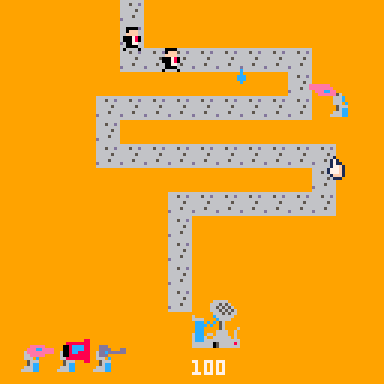

# Spray Ya Later Litigator
You have invented a weather machine that will bring rain
to the desert. But Big Water has an army of lawyers, judges, 
and politicians to try to make you turn it off.
Use your water towers to soak their legal documents and keep operating.

Play it now on [itch.io](https://caterpillargames.itch.io/spray-ya-later-litigator)

## Controls
* Mouse - move cursor
* Click - pick up / place tower

## Hints
* You can only place one extra tower per wave

## About
<!--BEGIN TRIJAM-->
Created for [TriJam #160](https://itch.io/jam/trijam-160/entries)  
Theme: Don't turn it off  
Development Time: 4h40m for coding, 5h for assets  
<!--END TRIJAM-->

Source Code: On [GitHub](https://github.com/CaterpillarGames/pico8-games/tree/master/carts/spray-ya-later-litigator)

## Acknowledgements
[Evan Sampson](https://evanmrsampson.itch.io/) - additional designer, lead artist

