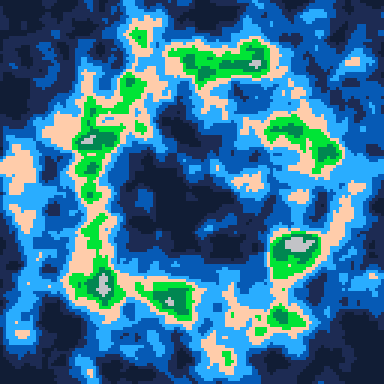

# Terrain Generator
Generate terrain using [Perlin noise](https://en.wikipedia.org/wiki/Perlin_noise)

Play it now on [itch.io](https://caterpillargames.itch.io/terrain-generator)

## Controls
* X - regenerate terrain

## About
Created for [TriJam #0](https://itch.io/jam/trijam-0/entries)  
Theme: None  
Development Time: 3h 12m 51s  

Source Code: On [GitHub](https://github.com/CaterpillarGames/pico8-games/tree/master/carts/terrain-generator)

