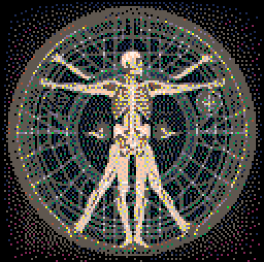

# The Titan
Uncover your nature and choose your destiny.

Play it now on [itch.io](https://minimechmedia.itch.io/the-titan)

## Controls
* X - Select choice
* Up Arrow Key / Down Arrow Key - Change choice
* P - Pause. Can restart the game

# About
Created for [Secret Santa Jam 2022](https://itch.io/jam/secret-santa-jam-2022)  

Source code available on [GitHub](https://github.com/CaterpillarGames/pico8-games/tree/master/carts/the-titan)

## Acknowledgements
* Game images generated with Dalle-2
* Cover art generated with Midjourney
* ChatGPT used for brainstorming sessions
* Images compressed using [Zep](https://www.lexaloffle.com/bbs/?uid=1)'s [PX9 algorithm](https://www.lexaloffle.com/bbs/?tid=34058)

One of the things my giftee's letter mentioned is that they were a fan of [Howling Dogs](https://xrafstar.monster/games/twine/howlingdogs/),
an interactive fiction game written with Twine. This worked out well because I had been toying with the idea of a visual
novel in PICO-8 ever since getting access to Dalle-2. Thank you giftee, for providing the
perfect opportunity to make it happen!
