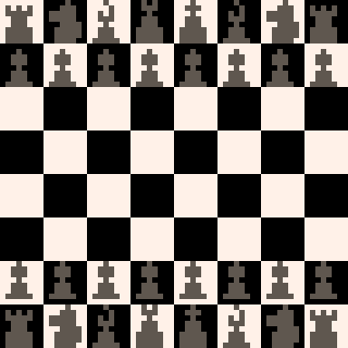

# Tiny Chess Board
Non-interactive 64x64 chessboard made in 253 PICO-8 characters.

This is my first attempt at a tweet cart. I'm sure it can be paired down more. Feedback welcome!

```
poke(13-😐,3)for i=0,63do
x=i%8*8y=i\8*8r="\0*>、、>>>"n="▮8>>x||<"b="⁸▮⁘、⁸、、>"rectfill(x,y,x+8,y+8,(i+i\8+1)%2*7)if(y<1or i>55)print("\^."..({r,n,b,"⁘、⁸、、>>>","⁸、⁸、、>>>",b,n,r})[x/8+1],x,y,5)
if(y==8or y==48)print("\^.\0⁸、、⁸、、>",x,y-i\48,5)
end::_::goto _
```

[](https://caterpillargames.itch.io/tiny-chess-board)

Play it now on [itch.io](https://caterpillargames.itch.io/tiny-chess-board)

## Controls
Eyes - look at chessboard


## About

Created for [Tiny Cart Jam #1](https://itch.io/jam/pico-8-tiny-cart-chaos-/entries)

- [X] Uses exactly 3 colors
- [X] Maximum 300 characters (273)

Source Code: On [GitHub](https://github.com/CaterpillarGames/pico8-games/tree/master/carts/tiny-chess-board)

## Acknowledgements
Piece sprites converted to one-off character codes using [Bitdraw!](https://www.lexaloffle.com/bbs/?pid=102723) tool by [CoffeeBat](https://www.lexaloffle.com/bbs/?uid=50382)

A few characters saved by using [Constant Companion](https://www.lexaloffle.com/bbs/?tid=44801) tool by [pancelor](https://www.lexaloffle.com/bbs/?uid=27691)


