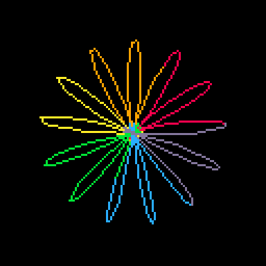

# VCO Tweet
> The object has no applications to chemistry, physics, physiology,
engineering, medicine, agriculture, nor any practical use of any kind. 
Yet none dispute that it is very compelling.<br>
<cite>- E.D.B.</cite>

This is an animation of a [Toroflux](https://flowtoys.com/toroflux) as it expands and collapses, better
known by some as a V.C.O.


[](https://minimechmedia.itch.io/vco-tweet)

Leave a comment on [Twitter](https://x.com/MiniMechMedia/status/1816985455067316338) or [itch.io](https://minimechmedia.itch.io/vco-tweet)

This cart is tweetable at just 228 characters.

## Source
Remix it on [pico-8-edu.com](https://pico-8-edu.com/?c=AHB4YQGVAS7rwTMc-QCjr-AOlwdJY-AzO_OKO4pkpQ1e4PwnKMqmze83wfXZ8aklnqELyuIhXuEVurrYSFei0gJvEFX5Q7yBN5ImaPPrrgoMtzOSr0QKIgIi_kFBF1fVcTv9RLlSt-lDREFTZVlWZVmbNVVWqRKUqkTnCIxnKAgvLPIuKqKi34k2gjcogiRc6q46q4rKcsIGE-FCWS4c2O50dVd2g0vHtW9wXXZe-QpDW5MzC6v3tUkwG6ZdHBqhSZONifvGmp378pGgTWYO9EKetTthP9w7oV8Kh7puutuy6lNYxV-bzUwZx1kTFuHKShw-hR263bJs7aZENLPStAPJULNRG6OxhTeSJBi4cWTNGgM_GUrjpcVyu10ZXR1sNmfrLRWD7c3dYna5DA==)
```lua
c=cos
s=sin
::_::
cls()
line()
a=t()/9
p=s(a/1.3)^2/4
for i=0,200do
i/=200
r=(1+c(p*2))/2.5+c(i*13)
u=c(i+a*4)
v=s(i+a*4)
z=s(i*13)
x=r*u+z*v*s(p)
y=r*v-z*u*s(p)
line(25*(x*c(a)-z*c(p)*s(a))+64,25*y+64,i*5.9+8)
end
flip()
goto _
```

## Explanation
Remix it on [pico-8-edu.com](https://pico-8-edu.com/?c=AHB4YQsMBXDrwTMc-QCjr-AOlwdJY-AzO_OKO4pkpQ1e4PwnKMqmze83wfXZ8aklnqELynLiGaKoiZMXSDfqd3gBUyRN8Az1cUcFhpsZyRci6RDlEOGgoIur6raZfqXcqNt8JAqaKsuyKsvarKmySo6glCMSGNmYKpMkf4agGamSoTYOw52Briq2yvAlIl2BlagOHLOSP0M0MnKYXkgdrpTtOyw0G0lU90m7lTeZzkARhQvFO9RrL7GmKeKajawKJlY28qW8ybOiipaqpFjIQj_U2UqoMbAgNTQRC4Y2A6Eb9MJ-KQwsxAuS5V0ou3pASMwC9ZgZlBJmFrKu0CYSLtM5KYpYKqDIF1aUBnPxEZlit2UjWiUqA3PBOxTB4ELYXXZapYAQ20D7ZCkfqVUVtBSaGWmTqT4yxVK0suWIKjNNN1CqCcTFmUsDA5NHKqyEbd8NNCMjYkkbUTSZrFSBTEk0IXwOw8graZJnbSNaqYJ2S7IgifI1U2gTCDVoyYgFrUoYLRTlWi0q4I2VbKMSfxldFUTbWAllSWZ3LpwKZMKmxrZmBAqilYGBhbE2nrqwfocTswFxM4Ul-YJUDEbaQIViJq2NESwODkZrUkLNzPTeUqiyNLmqH9MKW0xpROWiD0NtLDkwVORtkO_pQ4la5J0xZyYUpJJmQHkhjKUNQutqhjOZ1gyHolShItOUSZdIsNZPofVWjigXNwuCNsv1WjGR3ljcONKWmT7Fbj8SWGVmsRdxGvL-pYbi3wn9gLp2jPk8IyhX9FWsT54m3Yh2qnXbp5mxPbR1JAe8q8Umfahx7iTsXNcXkjyS4X_k1COEb_1_6LCE2fKSpFQ01a3E9ZjeRjXjDrkOzSY9dzhCWTMbVbNRSVgaHlhMgoFOwbSs2wF9jLWkWlCcmEjyVX2FjaoQvcnN0FejV0pQJerTKjPxaCUjoO7Z5vrhS1PFCx2fRKdjPU-mFKSkzi2epXbGGiHVzk7YVs2a3I8dFgYWBJAlROTD-2kFDIRhmm8hS6hZ1FOiPEedgEaY-ZEez5KG1IJ8xFhdq65XGkGOSBTeYulZ2l3WQNSHn3Bbnm9sNGvFQDMiudNq_kxsFQATNCcq-nQTfhhN4mIw21taqnLDlIUAhA5XqLmzpLmxFKvRP6AUni5LB-am264VPtnwjIyXhkfeacFqXmqQ31WlQaoena4NzmUoF6QDEWdFj3xBSZsp9_yo50g4dI1SRTzQDChPJbQVpuHTqlKpQOggQE5IKWIhcKRuJV1EjCFijm0jATWQJKFallJa2TStKka2Njq0KveXxQN7m6vBZjJ4pQrdkIRSHyYTs82CkH9Ue9TSKVUSxbqtzUgglDKYqDtjX9DKkojCVNFq6GNV_2_nXWGPcAj6TO21oj47aVSqNkSqC6lQ04LQm7DlQL6mT6tBLd_sNbDWJI1uTLSh2lU1oVLSBBuEv3EXxMnSsl7PYLNPw2FdPb4wUms9Kd4frbKE8EOzIp6WrYgHrO3MVGgUaLdNOwmbAwUEBttyKcmSKlQ4E0UfZ4SfEpriT7EKmpKa-H86xYRoN9Ikkv5ZYONAng3UdppTdBM3WRPDCcakv2g9ZGEiAZZAHZ-JIsCLcAuTf01KIOJUblprdKaKeEvmR9BSaqqqCEe8rSBJtLE6IvC3tTIz0qwU8mlSFGU469xoNstC56sJ5FBV2VMV6ueQPsdLzBRkGVht7szXy0gaKkYwMzYm2rG2OSqbt5YpIE2FEjDD0yQforMn9ZEu7AlAxkQiMjtTCySJfOR76-m24uUI_ohNz_xMLtJ00MDg2JyRFM3EjZom2BqfXhEJGPSJMHE1Ocp2AsNTO9sIJbC4I0NxQBg=)
```lua
-- We will be drawing a Very Compelling Object,
-- also known by the name Toroflux.
-- The collapsed state is shaped like a ring and
-- the expanded state is shaped like a torus.
-- We will be creating an animation where the object
-- repeatedly expands and collapses and rotates.
::_::
cls()
line()
-- A parameter used for a number of use cases
a=t()/9
-- Controls the progression of the expansion
-- and collapse. Smoothly oscillates between
-- 0 and 90 degrees (in PICO-8 an angle of 1/4==90 deg)
phase=sin(a/1.3)^2/4
-- A torus can be formed as a surface of revolution by
-- sweeping one circle (called the minor circle) 
-- around another circle (called the major circle).
-- A standard parametization of a torus is
-- x = (R+r*cos(theta))cos(phi)
-- y = (R+r*cos(theta))sin(phi)
-- z = r*sin(theta)
-- Where R is the major radius, r is the minor radius,
-- phi is the angle around the major circle, and theta
-- is the angle around the minor circle.
-- We will be drawing a one dimensional curve along the
-- surface of the torus. 
for phi=0,200do
-- phi varies from 0 to 1 (remember, 1 = 360 deg in PICO-8)
phi/=200
-- theta from 0 to 1 means we are wrapping around the minor
-- circle. By multiplying by 13, we will wrap around the minor
-- circle 13 times by the time we traverse around the major
-- circle.
theta=phi*13
-- We will be varying the major radius from 0 to 0.8
-- The minor radius will implicitly be 1
-- Even when the major radius is maximized, it is still
-- smaller than the minor radius, creating a self-intersecting
-- spindle torus.
-- When the major radius is minimized, the torus would
-- degenerate into a sphere. But because of a rotation we
-- apply later on, it will create a circle laying flat
-- in the plane.
R=(1+cos(phase*2))/2.5
-- This is neither the major nor minor radius, but is
-- the effective radius for a point on the torus
radius=R+cos(theta)
-- u,v is a unit vector that when multiplied by the major
-- radius, coincides with the center of the minor circle.
-- Add a*4 to make the figure spin around the major axis.
u=cos(phi+a*4)
v=sin(phi+a*4)
z=sin(theta)
-- So (Ru,Rv,z) is a point on the surface of the torus.
-- We rotate that point around the (u,v,0) axis by an
-- angle of phase. This makes it so the line goes from
-- looping around the surface of the torus (expanded state)
-- to flattening into a plane (collapsed state). The
x=radius*u+z*v*sin(phase)
y=radius*v-z*u*sin(phase)
-- Rotate around the y-axis by an angle of `a`
-- phi*5.9+8 is the color, which will go from 8 to 13 as we
-- spiral around, producing a rainbow effect.
line(25*(x*cos(a)-z*cos(phase)*sin(a))+64,25*y+64,phi*5.9+8)
end
flip()
goto _
```


## About


Source code available on [GitHub](https://github.com/MiniMechMedia/pico8-games/tree/master/carts/vco-tweet)

